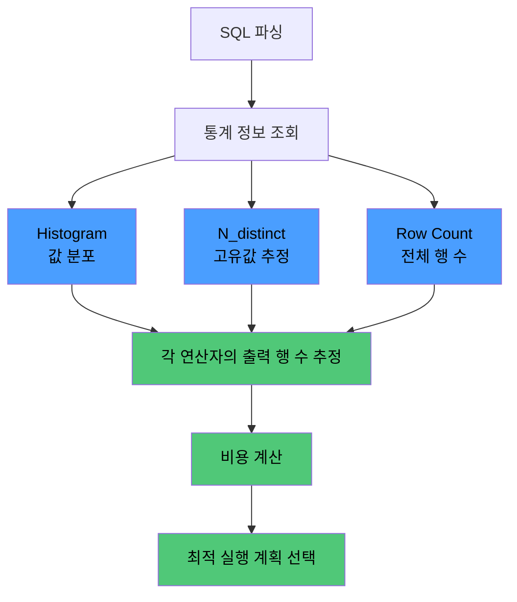

# Cardinality란

카디널리티(Cardinality)는 컬럼 값의 고유함 정도를 나타내는 지표로, 인덱스 설계와 옵티마이저의 실행 계획 결정을 좌우한다.

- 좁은 정의(컬럼 단위): 특정 컬럼에 존재하는 고유 값(Distinct Value)의 개수
- 넓은 정의(실행 계획 단위): 쿼리 실행 중 특정 연산자를 통과하는 예상 행 수
- 높다: 고유 값이 많아 중복이 적음 (예: 주민번호, 이메일, PK)
- 낮다: 고유 값이 적어 중복이 많음 (예: 성별, 상태, boolean)

## 인덱스 관점에서의 카디널리티

인덱스 효율은 카디널리티에 비례하기 때문에, 카디널리티가 낮은 컬럼에 단독 인덱스를 만드는 것은 거의 효과가 없다.

```sql
-- 1,000만 행 users 테이블
-- email: 1,000만 개 고유값 (카디널리티 매우 높음)
-- gender: 2개 고유값 ('M', 'F') (카디널리티 매우 낮음)

-- email 인덱스 조회 → 1건 선별
SELECT *
FROM users
WHERE email = 'alice@example.com';
-- B-Tree 탐색 O(log N) → 1행 접근, 매우 효율적

-- gender 인덱스 조회 → 500만 건 선별
SELECT *
FROM users
WHERE gender = 'M';
-- 인덱스 탐색 후 500만 번의 Random I/O 발생
-- → 옵티마이저는 Full Table Scan을 선택할 가능성이 높음
```

- 카디널리티가 낮은 컬럼에 단독 인덱스를 만들면 효과가 거의 없음
- 카디널리티가 낮은 컬럼은 복합 인덱스의 선두 컬럼으로 비효율적이므로, 보통은 뒤에 배치하거나 인덱스에서 제외하는 것이 좋음

## 옵티마이저의 카디널리티 추정

옵티마이저는 통계 정보를 바탕으로 각 연산자의 출력 카디널리티를 추정해 실행 계획을 결정한다.



### 통계 부정확으로 인한 문제

통계가 오래되거나 편향된 분포를 반영하지 못하면 옵티마이저가 잘못된 선택을 할 수 있다.

```sql
-- status 컬럼: 전체의 99%가 'COMPLETED', 1%가 'PENDING'
-- 통계가 균등 분포를 가정하면 옵티마이저는 각각 50%씩으로 추정할 수 있음

SELECT *
FROM orders
WHERE status = 'PENDING';
-- 실제로는 1%지만 옵티마이저가 50%로 예측 → 인덱스 대신 Full Scan 선택
-- → 히스토그램을 제대로 수집해야 1%를 인식하고 인덱스 사용
```

- 편향된 분포에는 반드시 Histogram이 필요
- MySQL 8.0+에서 `ANALYZE TABLE ... UPDATE HISTOGRAM ON` 문법 지원

## 조인에서의 카디널리티

조인 실행에서 카디널리티는 드라이빙 테이블 선택의 핵심 근거가 된다.

- 드라이빙 테이블: 조인의 시작점, 최종 결과 카디널리티가 가장 작은 쪽
- 드리븐 테이블: 드라이빙 행 각각을 기준으로 탐색
- 옵티마이저는 조건 적용 후 카디널리티를 추정해 가장 적은 행이 남는 테이블부터 읽도록 결정

```sql
-- 100만 users 중 1%만 'VIP', orders는 1억 행
SELECT *
FROM users u
         JOIN orders o ON u.id = o.user_id
WHERE u.type = 'VIP';

-- 올바른 순서: users의 VIP 10,000건을 먼저 찾은 뒤 → orders의 user_id로 탐색
-- 잘못된 순서: orders 1억 건을 먼저 스캔한 뒤 → users의 user_id로 탐색 (비효율적)
```
