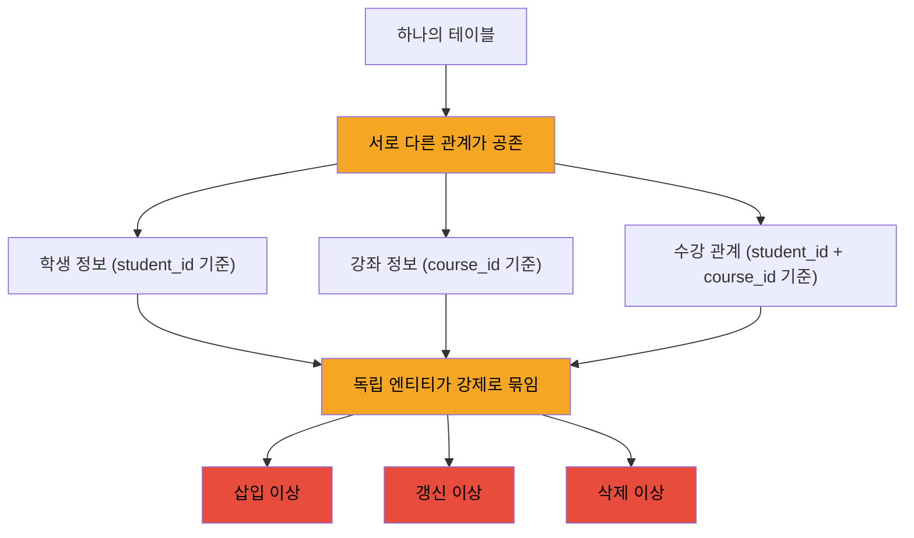

# 데이터베이스 이상(Anomaly) 현상이란

이상 현상(Anomaly)은 잘못된 테이블 설계로 인해 데이터 삽입·수정·삭제 시 원치 않는 부작용이나 논리적 모순이 발생하는 현상이다.

- 하나의 테이블에 서로 다른 종류의 데이터가 섞여 있을 때 발생
- 원인: 서로 다른 종속 관계가 한 테이블에 공존
- 해결: 정규화로 테이블을 분리

## 문제 상황 예시

학생, 수강, 강좌 정보가 한 테이블에 섞인 설계를 가정한다.

```sql
CREATE TABLE enrollments
(
    student_id   INT,
    student_name VARCHAR(50),
    course_id    INT,
    course_name  VARCHAR(100),
    professor    VARCHAR(50),
    grade        CHAR(1),
    PRIMARY KEY (student_id, course_id)
);

-- 데이터 예시
-- (1, Alice, 101, DB, Prof. Kim, A)
-- (1, Alice, 102, OS, Prof. Lee, B)
-- (2, Bob,   101, DB, Prof. Kim, A)
```

이 테이블에는 성격이 다른 관계가 섞여 있다.

- `student_id` 값이 정해지면 `student_name`이 결정됨 (학생 정보)
- `course_id` 값이 정해지면 `course_name`, `professor`가 결정됨 (강좌 정보)
- `(student_id, course_id)` 조합이 정해져야 `grade`가 결정됨 (수강 관계)

## 삽입 이상 (Insertion Anomaly)

새로운 강좌를 개설했지만 아직 수강생이 없을 때, 강좌 정보만 저장할 방법이 없다.

```sql
-- Prof. Park의 Network 강좌(103) 개설, 수강생 아직 없음
INSERT INTO enrollments
VALUES (NULL, NULL, 103, 'Network', 'Prof. Park', NULL);
-- PK가 (student_id, course_id)이므로 student_id NULL 불가
-- → 강좌를 등록하려면 가짜 학생을 만들어야 하는 모순
```

- 원인: 강좌 정보 저장에 학생 정보가 강제로 필요
- 결과: 독립적으로 존재해야 할 데이터를 저장 불가

## 갱신 이상 (Update Anomaly)

강좌 담당 교수가 변경되면, 해당 강좌를 수강하는 모든 행을 일괄 수정해야 한다.

```sql
-- DB 강좌의 담당 교수가 Prof. Kim → Prof. Choi로 변경
UPDATE enrollments
SET professor = 'Prof. Choi'
WHERE course_id = 101;
-- 수백 명이 수강 중이라면 수백 건을 모두 수정해야 함
-- 일부만 수정되면 한 강좌에 두 명의 교수가 존재하는 모순 발생
```

- 원인: "강좌의 담당 교수" 정보가 수강생 수만큼 중복 저장됨
- 결과: 정합성 훼손 위험, 수정 비용 증가

## 삭제 이상 (Deletion Anomaly)

특정 학생이 유일한 수강생이던 강좌에서 그 학생이 수강 취소하면, 강좌 정보 자체가 함께 사라진다.

```sql
-- Bob이 DB 강좌(101)의 유일한 수강생이라 가정, 수강 취소
DELETE
FROM enrollments
WHERE student_id = 2
  AND course_id = 101;
-- Bob 행만 지우려 했지만, 이 행이 DB 강좌 정보를 담은 마지막 행
-- → DB 강좌 정보(course_name, professor)가 함께 소실
```

- 원인: 강좌 정보가 수강 관계 행에 의존
- 결과: 유지해야 할 정보가 의도치 않게 소실

## 이상 현상의 원인



- 강좌의 담당 교수가 수강생 수만큼 중복 저장됨
- 중복된 사본 중 하나라도 어긋나면 전체 정합성이 깨짐
- 독립 엔티티(학생, 강좌, 수강)를 분리하면 해결 → 정규화

## 정규화로 해결

학생과 강좌 사이의 다대다(N:M) 관계인데, 이 정보를 한 테이블에서 관리하다 보니 이상 현상이 발생했다.

- 학생 한 명이 여러 강좌를 수강 → `student_name`이 수강 강좌 수만큼 중복
- 강좌 한 개를 여러 학생이 수강 → `course_name`, `professor`가 수강생 수만큼 중복

세 테이블로 분리하면 모든 이상 현상이 사라진다.

```sql
-- 학생 테이블
CREATE TABLE students
(
    student_id   INT PRIMARY KEY,
    student_name VARCHAR(50)
);

-- 강좌 테이블
CREATE TABLE courses
(
    course_id   INT PRIMARY KEY,
    course_name VARCHAR(100),
    professor   VARCHAR(50)
);

-- 수강 테이블 (관계)
CREATE TABLE enrollments
(
    student_id INT,
    course_id  INT,
    grade      CHAR(1),
    PRIMARY KEY (student_id, course_id),
    FOREIGN KEY (student_id) REFERENCES students (student_id),
    FOREIGN KEY (course_id) REFERENCES courses (course_id)
);
```

- 수강생 없는 강좌 등록 가능 (삽입 이상 해결)
- 교수 변경은 courses 한 행만 수정 (갱신 이상 해결)
- 수강 취소해도 강좌 정보 보존 (삭제 이상 해결)
