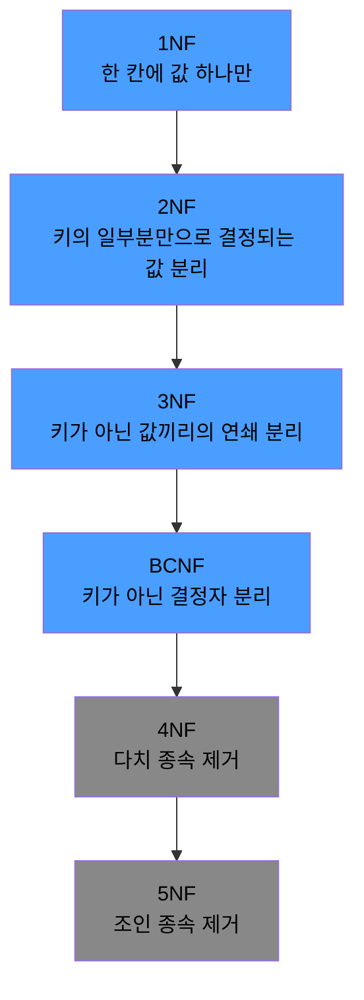

# 정규화란

정규화(Normalization)는 같은 사실을 한 곳에서만 관리하도록 테이블을 쪼개 나가는 설계 과정으로, 데이터 중복과 이상 현상을 없애는 것이 목적이다.

- 목적: 중복 제거, 이상 현상(Anomaly) 방지, 무결성 강화
- 방법: 1NF → 2NF → 3NF → BCNF 순서로 한 단계씩 분해

## 정규형의 단계



과한 정규화는 성능 저하로 이어질 수 있기 때문에, 실무에서는 3NF 또는 BCNF까지만 적용하는 경우가 많다.

## 제1정규형 (1NF) - 한 칸에는 값 하나만

한 칸에 여러 값이 들어간 컬럼은 값 하나씩 쪼개서 별도 테이블로 빼낸다.

회원 테이블의 전화번호 컬럼에 여러 번호를 몰아 적은 경우를 예로 든다.

| 회원ID |  이름   |            전화번호            |
|:----:|:-----:|:--------------------------:|
|  1   | Alice | 010-1111-2222, 02-123-4567 |
|  2   |  Bob  |       010-3333-4444        |

`010-1111-2222`로 특정 회원을 찾으려면 문자열 파싱이 필요하고, 번호를 추가·삭제할 때도 전체 문자열을 수정해야 한다. 전화번호를 별도 테이블로 빼낸다.

```sql
CREATE TABLE members
(
    member_id INT PRIMARY KEY,
    name      VARCHAR(50)
);

CREATE TABLE member_phones
(
    member_id INT,
    phone     VARCHAR(20),
    PRIMARY KEY (member_id, phone)
);
```

| 회원ID |  이름   |
|:----:|:-----:|
|  1   | Alice |
|  2   |  Bob  |

| 회원ID |     전화번호      |
|:----:|:-------------:|
|  1   | 010-1111-2222 |
|  1   |  02-123-4567  |
|  2   | 010-3333-4444 |

## 제2정규형 (2NF) - 키의 일부분만으로 결정되는 값은 분리

복합키의 일부분만으로 결정되는 컬럼은 그 결정자 쪽 테이블로 뽑아낸다.

주문상세 테이블에 상품명과 단가가 같이 적힌 경우를 예로 든다.

| 주문ID | 상품ID | 상품명 | 수량 |   단가    |
|:----:|:----:|:---:|:--:|:-------:|
| O01  | P01  | 노트북 | 1  | 1500000 |
| O01  | P02  | 마우스 | 2  |  20000  |
| O02  | P01  | 노트북 | 1  | 1500000 |

기본키는 `(주문ID, 상품ID)`인데, 상품명·단가는 상품ID만으로 결정된다 (P01 → 노트북, 1500000). 주문ID는 상품명·단가를 결정하는 데 관여하지 않으므로, 상품ID를 기준으로 뽑아낸다.

```sql
CREATE TABLE products
(
    product_id VARCHAR(10) PRIMARY KEY,
    name       VARCHAR(50),
    price      INT
);

CREATE TABLE order_items
(
    order_id   VARCHAR(10),
    product_id VARCHAR(10),
    quantity   INT,
    PRIMARY KEY (order_id, product_id)
);
```

| 상품ID | 상품명 |   단가    |
|:----:|:---:|:-------:|
| P01  | 노트북 | 1500000 |
| P02  | 마우스 |  20000  |

| 주문ID | 상품ID | 수량 |
|:----:|:----:|:--:|
| O01  | P01  | 1  |
| O01  | P02  | 2  |
| O02  | P01  | 1  |

노트북 단가가 바뀌어도 `products`의 한 행만 수정하면 된다.

- PK가 단일 컬럼이면 "일부분"이라는 개념이 없어 2NF는 자동 충족
- 복합키를 쓸 때만 의미를 가짐

## 제3정규형 (3NF) - 키가 아닌 값끼리의 연쇄 분리

키가 아닌 컬럼끼리 연쇄로 결정되는 관계는 중간값을 기준으로 테이블을 한 번 더 쪼갠다.

직원 테이블에 부서 정보가 같이 적힌 경우를 예로 든다.

| 직원ID |  이름   | 부서ID | 부서명  |
|:----:|:-----:|:----:|:----:|
| E01  | Alice | D01  | 개발팀  |
| E02  |  Bob  | D01  | 개발팀  |
| E03  | Carol | D02  | 마케팅팀 |

직원ID가 PK인데 "직원ID → 부서ID → 부서명" 연쇄가 존재한다 (부서명은 부서ID로 결정됨). 그 결과 "개발팀"이 직원 수만큼 반복된다. 중간값인 부서ID를 기준으로 테이블을 한 번 더 분리한다.

```sql
CREATE TABLE departments
(
    dept_id VARCHAR(10) PRIMARY KEY,
    name    VARCHAR(50)
);

CREATE TABLE employees
(
    employee_id VARCHAR(10) PRIMARY KEY,
    name        VARCHAR(50),
    dept_id     VARCHAR(10),
    FOREIGN KEY (dept_id) REFERENCES departments (dept_id)
);
```

| 부서ID | 부서명  |
|:----:|:----:|
| D01  | 개발팀  |
| D02  | 마케팅팀 |

| 직원ID |  이름   | 부서ID |
|:----:|:-----:|:----:|
| E01  | Alice | D01  |
| E02  |  Bob  | D01  |
| E03  | Carol | D02  |

부서명이 바뀌어도 `departments`의 한 행만 수정하면 된다.

## BCNF (Boyce-Codd Normal Form)

키가 아닌 컬럼이 다른 컬럼을 결정하고 있으면, 그 결정 관계를 별도 테이블로 분리한다.

고객 문의 배정 테이블을 예로 든다 (각 담당자는 하나의 카테고리 전담 상담사).

| 고객ID | 카테고리 |  담당자  |
|:----:|:----:|:-----:|
| C01  |  반품  | Alice |
| C01  |  배송  |  Bob  |
| C02  |  반품  | Carol |
| C02  |  배송  |  Bob  |

기본키는 `(고객ID, 카테고리)`이지만, "담당자 → 카테고리"도 성립한다 (Alice·Carol은 반품 전담, Bob은 배송 전담). 담당자는 키가 아닌데도 카테고리를 결정하고 있어 BCNF를 위반한다.

담당자의 전담 카테고리가 바뀌면 해당 담당자가 들어간 모든 행을 수정해야 하므로, "담당자 → 카테고리" 관계를 별도 테이블로 분리한다.

```sql
CREATE TABLE agents
(
    agent    VARCHAR(50) PRIMARY KEY,
    category VARCHAR(50)
);

CREATE TABLE inquiries
(
    customer_id VARCHAR(10),
    agent       VARCHAR(50),
    PRIMARY KEY (customer_id, agent)
);
```

|  담당자  | 카테고리 |
|:-----:|:----:|
| Alice |  반품  |
|  Bob  |  배송  |
| Carol |  반품  |

| 고객ID |  담당자  |
|:----:|:-----:|
| C01  | Alice |
| C01  |  Bob  |
| C02  | Carol |
| C02  |  Bob  |

담당자의 전담 카테고리가 바뀌어도 `agents`의 한 행만 수정하면 된다.

- 3NF와 BCNF는 대부분의 경우 결과가 같음
- 위 예시처럼 후보키끼리 겹치는 특수 상황에서만 차이가 드러남

## 반정규화 (Denormalization)

정규화는 이상 현상을 막지만, 테이블이 많이 쪼개질수록 조회 시 조인 비용이 커진다.

|  측면   |     정규화      |      반정규화       |
|:-----:|:------------:|:---------------:|
| 중복 제거 |      O       |    의도적 중복 허용    |
| 쓰기 성능 | 유리 (한 곳만 수정) |  불리 (여러 곳 동기화)  |
| 읽기 성능 |  불리 (조인 비용)  |   유리 (조인 불필요)   |
|  정합성  |    자동 보장     |    수동 보장 필요     |
| 주 사용  |   OLTP 시스템   | OLAP, 분석·보고 시스템 |

실제로 반정규화는 다음과 같은 형태로 자주 도입된다.

- 집계 컬럼 추가: 게시글 테이블에 댓글 수(`comment_count`) 저장 → 매번 COUNT 쿼리 회피
- 조회용 중복 컬럼: 주문 테이블에 고객 이름을 함께 저장 → 조인 없이 리스트 조회
- 파생 테이블: 일·월 단위 집계 테이블을 배치로 생성 → 대시보드 실시간 집계 비용 절감

반정규화는 정규화를 건너뛰는 것이 아니라, 정규화된 설계를 이해한 뒤 의도적 트레이드오프로 도입하는 것이다.

## 정규화의 현실적 한계

- 조인 비용: 정규화 단계가 깊어질수록 조인 수가 늘어나 읽기 성능 저하
- NoSQL 환경: 문서형 DB는 중첩 문서를 허용해 1NF부터 의도적 위반
- MSA 환경: 서비스 경계로 테이블이 물리적으로 분리되어 전역 정규화 자체가 불가능

설계는 정규화를 기본으로 하되, 읽기/쓰기 비율, 조회 패턴에 따라 반정규화 여부를 결정한다.
