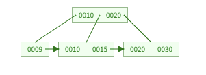

# 인덱스를 구현하는 자료 구조에 대해 설명해 주세요.

구현하기 위해 다양한 자료구조를 활용할 수 있습니다.

대표적인 것이 **해시 테이블**과 **B+트리** 그리고 **B 트리**입니다.

B 트리는 아래 링크를 클릭하세요.

### 해시 테이블

해시 테이블은 `(key, value)` 로 데이터를 저장하는 자료 구조입니다.

우리가 Key를 안다면 이를 통해 Value를 바로 알 수 있습니다.

이 모습이 마치 인덱스 원리와 도일하지 않나요?

우리는 **해시 함수** 를 이용해 키를 특정 주소로 변환합니다.

정말 매우 빠릅니다! 해시 함수만 수행 한다면 바로 위치를 알 수 있으니까요!
이의 시간 복잡도는 `O(1)` 입니다.

그러나 단점도 존재합니다.

해시 함수는 값이 1개라도 변하면 다른 값이 나오게 됩니다.

그렇기에 LIKE `abc%` 와 같이 abc 가 포함된 인덱스를 찾는 것이 불가능합니다.

또한 범위 탐색이 불가능합니다.

우리는 해시 함수를 통해 값을 저장하는 것 뿐이지 0과 1을 해시 함수에 넣어도 이는 연속된 수가 아니기 때문에 범위 탐색이 불가합니다.

### B+ 트리

B 트리를 개선 시킨 자료구조 입니다.

차이점은 B트리는 모든 노드에 데이터를 저장했지만 아래와 같은 차이점이 있습니다.

1. 리프토드만 인덱스와 함께 데이터를 가지고 있고, 나머지 노드는 데이터를 위한 인덱스만 가진다.

2. 리프 노드들은 LinkedList로 연결되어 있다.

3. 데이터 노드 크기는 인덱스 노드의 크기와 같지 않아도 된다.

위에서 리프 노드는 LinkedList로 연결되어 있다고 했으니, 이는 범위 탐색에 탁월합니다! 

만약 id가 50~100 사이의 자료를 찾고 싶을 때 부등호를 사용하는 순차 검색연산에 자주 사용됩니다.

따라서 O(logN) 이라는 시간 복잡도를 가지게 되어 해시보다 적합합니다.

# 한 줄 요약
> 일반적인 데이터 베이스 시스템의 자료 구조는 B 트리와 해시, 그리고 B+가 있습니다.
> 해시 테이블은 해시 함수를 사용해 O(1) 이라는 빠른 속도를 보장하지만, 값이 조금만 달라도 완전히 다른 해시값입니다. 이로 인해 범위 탐색이나 부등호 연산, 일치 내용 찾기 등이 불가능합니다.
> 반면 B+ 트리는 데이터가 정렬된 상태로 리프 노드에 저장되어, 이 리프 노드들이 연결 리스트로 이어져 있습니다. 그 때문에 O(logN) 이라는 안정적인 탐색 속도를 가져 범위 쿼리나 정렬 성능이 더 우수합니다.
> 따라서 단일 행 조회가 목적인 Key-Value DB 가 아니라면 범용적인 RDBMS 는 B+ 트리가 더 적합합니다.

## 추가 자료

### LSM -Tree

이는 변경 사항을 메모리에 먼저 기록하고, 일정량이 쌓이면 디스크에 순차적으로 저장하며 나중에 머지합니다.

그렇기에 쓰기 성능을 극대화 시킵니다. (순차적으로 디스크에 작성)

그러나 읽기 시 메모리를 보거나 디스크를 보거나 등 여러 파일을 찾아야 할 수 있어 B- Tree보다 떨어질 수 있습니다.

MongoDB의 WiredTiger 엔진이 이를 사용합니다.

### Bitmap Index

각 고유값에 대해 0과 1로 만들어 저장합니다.

예를 들어 남성이라면 0101 여성이라면 1010 이라고 만듭니다.

만약 데이터의 종류(Cadinality)가 적을 때 공간 효율이 극대화될 수 있습니다.

또한 장점이 바로 비트 연산(AND, OR) 으로 복합 연산이 매우 빠릅니다.

이는 분석용 DB 에 주로 사용 됩니다.
