# 인덱스의 특징에 대해 아는 대로 말해보세요.

> 이 부분에서는 전체적인 인덱스에 대해서 다시 설명하고 넘어가겠습니다.

🖐️ 인덱스란 데이터 베이스 검색 속도를 높이기 위해 특정 컬럼 기준으로 미리 정렬해 관리하는 별도 테이블 구조입니다.

🖐️ 가장 큰 장점은 `SELECT` 쿼리에서 `WHERE` 이나 `ORDER BY`같은 조건절이나 정렬을 처리할 때, 전체 테이블을 스캔하지 않아도 데이터에 빠르게 접근할 수 있습니다.

🖐️ 반면 인덱스를 저장하기 위한 추가 물리 공간과 데이터 변경이 발생 시 인덱스 구조를 실시간 정렬과 갱신이 필요해 쓰기 성능이 저하될 수 있습니다.

🖐️ 그렇기에 인덱스는 데이터 중복도가 낮고 조회 빈도가 높은 컬럼 중심으로 설계해야 합니다.

---

## 1. 인덱스의 정의와 목적

- 인덱스란 데이터베이스 테이블에서 **검색 속도**를 높이기 위해 **별도로** 관리하는 **데이터 구조**입니다.

- 인덱스는 특정 컬럼의 값과 해당 값이 저장된 테이블 행(ROW)의 **물리적 주소**(RID/TID)를 쌍으로 제공합니다.

- 인덱스의 가장 큰 특징은 항상 **정렬된 상태를 유지**한다는 것입니다.

- 그렇기에 이진 탐색과 유사한 방식으로 데이터를 찾아낼 수 있습니다.

- 대부분의 RDBMS는 B+Tree 구조를 사용합니다.

- 그 이유는 모든 Leaf Node가 **Linked List**로 연결되어 범위 Scan 에 유리하기 때문입니다.

### 인덱스가 없을 때 vs 있을 때

100만 명의 사용자 테이블에서 특정 이메일을 찾는다고 가정합니다.

```sql
-- users 테이블: id, name, email, age (100만 행)
SELECT * FROM users WHERE email = 'alice@example.com';
```

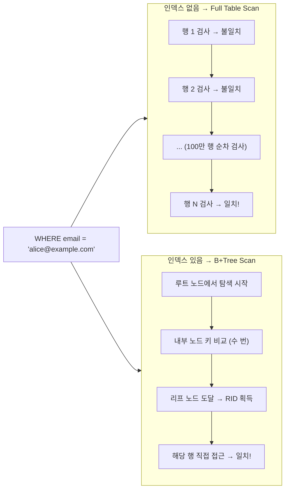

```sql
-- 인덱스 생성
CREATE INDEX idx_users_email ON users(email);

-- 실행 계획으로 인덱스 사용 여부 확인
EXPLAIN SELECT * FROM users WHERE email = 'alice@example.com';
-- type: ref, key: idx_users_email 로 인덱스 사용 확인
```

---

## 2. 인덱스의 자료구조

### 2-1. B-Tree

모든 노드(루트, 내부, 리프)에 **키와 데이터 포인터를 함께 저장**합니다.

- 탐색 시 내부 노드에서도 데이터를 찾을 수 있습니다.
- 범위 검색 시 매번 루트부터 다시 탐색해야 하므로 비효율적입니다.

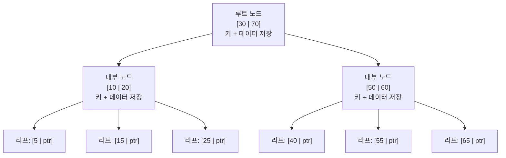

**탐색 예시: 값 15를 찾는 경우**

```
루트 [30|70] → 15 < 30 이므로 왼쪽 → 내부 [10|20] → 10 < 15 < 20 → 중간 → 리프 [15|ptr]
```

**범위 탐색의 문제: 값 25 ~ 40 범위를 찾는 경우**

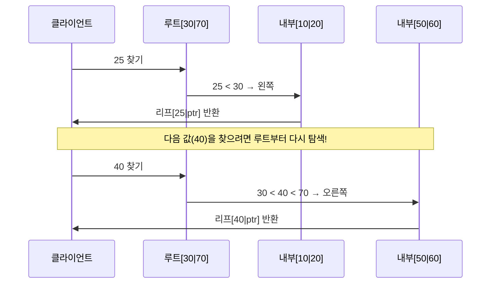

> 단점: 범위 검색마다 루트로 되돌아가야 하므로 B+Tree 대비 느립니다.

---

### 2-2. B+Tree

**내부 노드에는 키만** 저장하고, **리프 노드에만 실제 데이터 포인터**를 저장합니다.
리프 노드끼리 **Linked List**로 연결되어 범위 검색(Range Scan)에 매우 유리합니다.

**[ 트리 구조 ]**

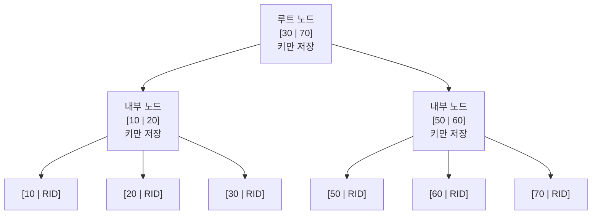

**[ 리프 노드 Linked List — 범위 검색 시 순차 탐색 ]**

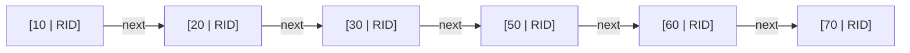

**범위 검색 예시: 20 이상 50 이하**

```sql
SELECT * FROM orders WHERE amount BETWEEN 20 AND 50;
```

```
1. B+Tree 탐색으로 20이 있는 리프 노드 도달
2. Linked List를 따라 오른쪽으로 순차 탐색: [20] → [30] → [50]
3. 51이 나오는 순간 탐색 종료 → 루트로 되돌아갈 필요 없음!
```

> 장점: 범위 조건(`BETWEEN`, `>`, `<`)에서 리프 노드만 순차 탐색하면 됩니다.

---

### 2-3. Hash Index

해시 함수로 키를 **버킷(Bucket)**에 매핑합니다.

- **등치 조건(`=`)** 검색에서 O(1)로 매우 빠릅니다.
- 해시 결과는 정렬이 무의미하므로 **범위 검색 불가**합니다.
- MySQL MEMORY 엔진, Redis 등에서 활용합니다.

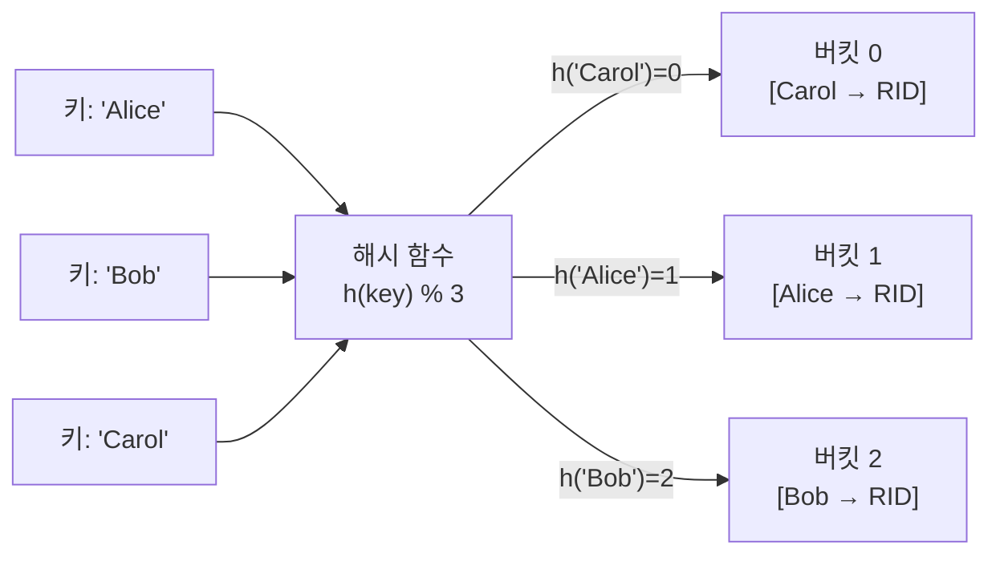

```sql
-- MySQL MEMORY 엔진에서 Hash Index 사용
CREATE TABLE session_cache (
    session_id VARCHAR(64) NOT NULL,
    user_id    INT,
    INDEX USING HASH (session_id)   -- 해시 인덱스 명시
) ENGINE = MEMORY;

-- O(1) 탐색: 가능 (등치 조건)
SELECT * FROM session_cache WHERE session_id = 'abc123';

-- 범위 검색: 불가 (해시는 순서 정보가 없음)
SELECT * FROM session_cache WHERE session_id > 'abc100';  -- 인덱스 미사용
```

| 조건 | B+Tree | Hash Index |
|------|--------|------------|
| `= (등치)` | O(log n) | **O(1)** |
| `BETWEEN`, `>`, `<` | **가능** | 불가 |
| `ORDER BY` | **가능** | 불가 |
| `LIKE 'abc%'` | **가능** | 불가 |

---

## 3. 클러스터형 vs 비클러스터형

### 클러스터형 인덱스 (Clustered Index)

- 테이블 데이터 자체가 인덱스 키 순서대로 **물리적으로 정렬**됩니다.
- 리프 노드 = 실제 데이터 페이지이므로 추가 I/O가 없습니다.
- 테이블당 **1개만** 존재 가능 (MySQL InnoDB에서는 PK가 자동으로 클러스터형)

```sql
-- MySQL InnoDB: PRIMARY KEY가 자동으로 Clustered Index
CREATE TABLE users (
    id    INT PRIMARY KEY,   -- 이 컬럼 기준으로 데이터 물리 정렬
    name  VARCHAR(50),
    email VARCHAR(100)
);

-- PK 순서로 삽입해도 내부적으로 id 기준 정렬 유지
INSERT INTO users VALUES (3, 'Carol', 'carol@ex.com');
INSERT INTO users VALUES (1, 'Alice', 'alice@ex.com');
INSERT INTO users VALUES (2, 'Bob',   'bob@ex.com');

```

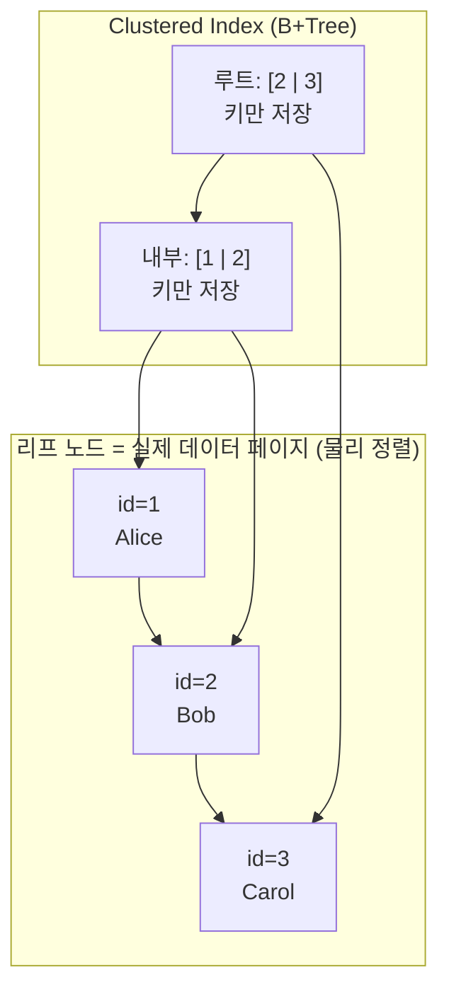

---

### 비클러스터형 인덱스 (Non-Clustered Index)

- 인덱스와 실제 데이터가 **별도의 공간에 저장**됩니다.
- 리프 노드에 실제 행의 주소(RID)를 저장하므로, 조회 시 추가 I/O가 발생합니다.
- 테이블당 **여러 개** 생성 가능합니다.

```sql
-- name 컬럼에 Non-Clustered Index 생성
CREATE INDEX idx_users_name ON users(name);

-- 조회 흐름:
-- 1) idx_users_name에서 'Bob' 탐색 → RID(행 주소) 획득
-- 2) RID로 실제 데이터 페이지 이동 → 행 반환 (추가 I/O 발생)
SELECT * FROM users WHERE name = 'Bob';
```

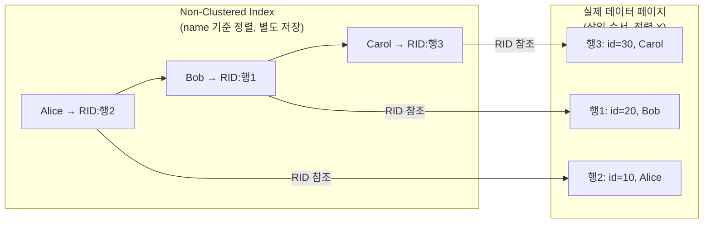

| 구분 | 클러스터형 | 비클러스터형 |
|------|-----------|-------------|
| 데이터 정렬 | 물리적으로 정렬됨 | 정렬 없음 |
| 리프 노드 | 실제 데이터 페이지 | RID(행 주소) |
| 개수 제한 | 테이블당 1개 | 여러 개 가능 |
| 범위 검색 | 매우 빠름 | 상대적으로 느림 |
| 추가 I/O | 없음 | RID로 추가 조회 필요 |

---

## 4. 인덱스 관리 비용

인덱스는 항상 **정렬 상태를 유지**해야 하므로, 데이터 변경 시 추가 작업이 발생합니다.

### 4-1. INSERT

삽입 시 인덱스에 새 키를 **정렬된 위치에 끼워 넣어야** 합니다.
노드가 가득 찰 경우 **Split(분할)** 이 발생합니다.

```sql
-- 데이터 삽입 → 인덱스도 함께 갱신됨
INSERT INTO users (id, name, email) VALUES (4, 'Dave', 'dave@ex.com');
-- 내부 동작: idx_users_name에 'Dave'를 정렬 위치(Carol 뒤)에 삽입
```

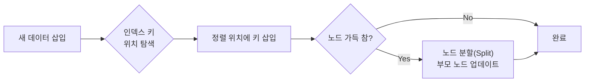

> 인덱스가 많을수록 삽입 비용이 선형으로 증가합니다. (인덱스 수 × Split 비용)

---

### 4-2. UPDATE

인덱스가 걸린 컬럼을 수정하면 **기존 키 삭제 → 새 키 삽입** 두 단계로 처리됩니다.

```sql
-- name 컬럼에 인덱스가 있을 때
UPDATE users SET name = 'David' WHERE id = 4;
-- 내부 동작:
-- 1) 인덱스에서 'Dave' 삭제
-- 2) 인덱스에서 'David' 를 정렬 위치에 삽입
```

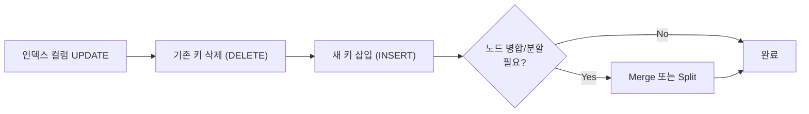

> UPDATE = DELETE + INSERT → **비용 2배**, 인덱스 컬럼 업데이트는 특히 주의가 필요합니다.

---

### 4-3. DELETE

인덱스에서 해당 키를 제거합니다.
노드의 키가 너무 줄어들면 **Merge(병합)** 이 발생합니다.

```sql
DELETE FROM users WHERE id = 4;
-- 내부 동작: 인덱스에서 'David' 삭제 후 필요 시 형제 노드와 병합
```

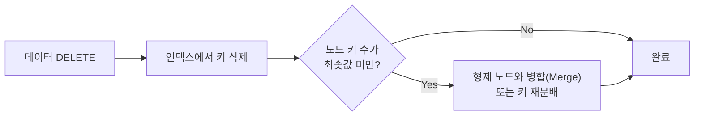

> MySQL InnoDB는 즉시 삭제 대신 **삭제 마크(delete-mark)** 를 먼저 표시하고,
> 이후 백그라운드 작업(Purge)에서 실제로 정리합니다. → 순간적인 쓰기 지연 감소

---

## 5. 인덱스 설계 원칙

### 5-1. Cardinality (카디널리티)

컬럼이 가진 **고유한 값의 수**를 의미합니다.
카디널리티가 높을수록 인덱스로 좁힐 수 있는 범위가 넓어져 효율이 좋습니다.

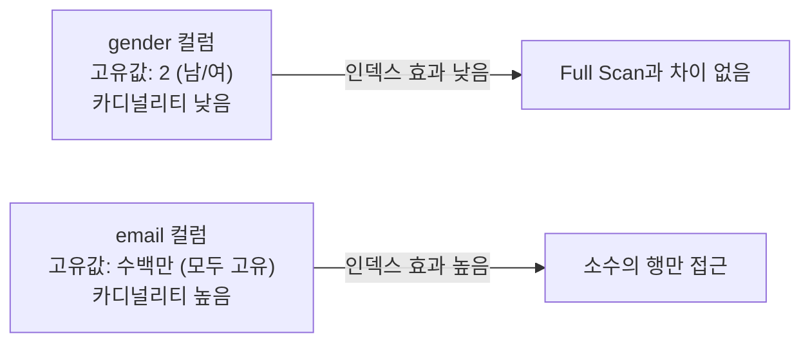

```sql
-- 카디널리티 확인 (고유값 수 / 전체 행 수)
SELECT
    COUNT(DISTINCT gender) / COUNT(*) AS selectivity_gender,   -- ≈ 0.000002 (매우 낮음)
    COUNT(DISTINCT email)  / COUNT(*) AS selectivity_email     -- ≈ 1.0 (매우 높음)
FROM users;
```

---

### 5-2. Selectivity (선택도)

`선택도 = 고유값 수 / 전체 행 수` (0 ~ 1 사이)

- 선택도가 **낮을수록(1에 가까울수록)** 인덱스가 효과적입니다.
- 일반적으로 선택도 **5% 이하**인 컬럼에 인덱스를 권장합니다.

```
예: users 테이블 1,000만 행

WHERE gender = '남' → 약 500만 행 반환 → 선택도 50% → Full Scan이 더 빠를 수 있음
WHERE email = 'a@b.com' → 1행 반환 → 선택도 0.00001% → 인덱스 매우 효과적
```

---

### 5-3. 복합 인덱스 (Composite Index)

두 개 이상의 컬럼을 조합한 인덱스입니다.
**왼쪽 컬럼부터 순서대로** 사용해야 인덱스가 적용됩니다. (Leftmost Prefix 규칙)

```sql
-- (last_name, first_name) 복합 인덱스 생성
CREATE INDEX idx_name ON users(last_name, first_name);

-- 인덱스 사용 O: 왼쪽 컬럼(last_name)이 포함된 경우
SELECT * FROM users WHERE last_name = 'Kim';
SELECT * FROM users WHERE last_name = 'Kim' AND first_name = 'Alice';

-- 인덱스 사용 X: 왼쪽 컬럼 없이 오른쪽 컬럼만 사용
SELECT * FROM users WHERE first_name = 'Alice';  -- Full Scan 발생
```

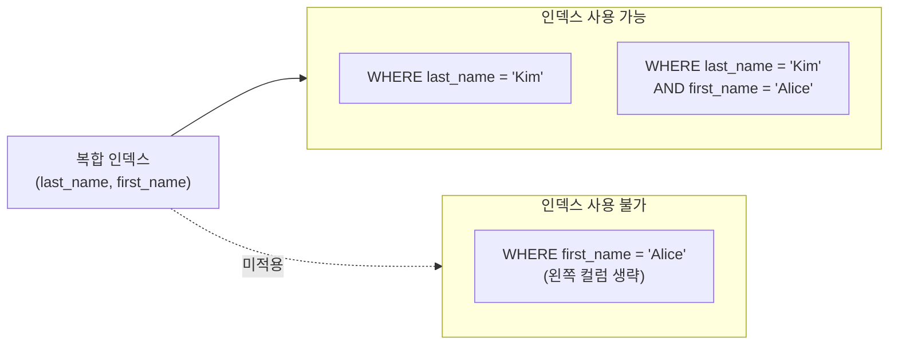

> 복합 인덱스 컬럼 순서는 **카디널리티가 높은 컬럼을 앞**에 배치하는 것이 일반적입니다.

---

### 5-4. 인덱스가 사용되지 않는 패턴

아래 패턴은 인덱스가 있어도 **Full Scan이 발생**합니다.

```sql
-- 1. 인덱스 컬럼에 함수 적용
SELECT * FROM users WHERE YEAR(created_at) = 2024;  -- ❌ (원래 값과 비교 불가, 모든 행을꺼내 함수를 실행해야 한다)
SELECT * FROM users WHERE created_at >= '2024-01-01' AND created_at < '2025-01-01';  -- ✅

-- 2. 앞에 와일드카드가 붙는 LIKE
SELECT * FROM users WHERE name LIKE '%Alice';   -- ❌ (앞이 가변이므로 정렬 의미 없음)
SELECT * FROM users WHERE name LIKE 'Ali%';    -- ✅ (앞부분 고정이므로 탐색 가능)

-- 3. OR 조건 (두 컬럼 모두 인덱스가 없으면 Full Scan)
SELECT * FROM users WHERE name = 'Alice' OR age = 25;  -- age에 인덱스 없으면 ❌

-- 4. 묵시적 형변환
SELECT * FROM users WHERE phone = 01012345678;  -- phone이 VARCHAR인데 숫자로 비교 ❌
SELECT * FROM users WHERE phone = '01012345678';  -- ✅

-- 5. NOT 조건 (<>, !=, NOT IN)
SELECT * FROM users WHERE status != 'active';  -- ❌ 보통 Full Scan
```

