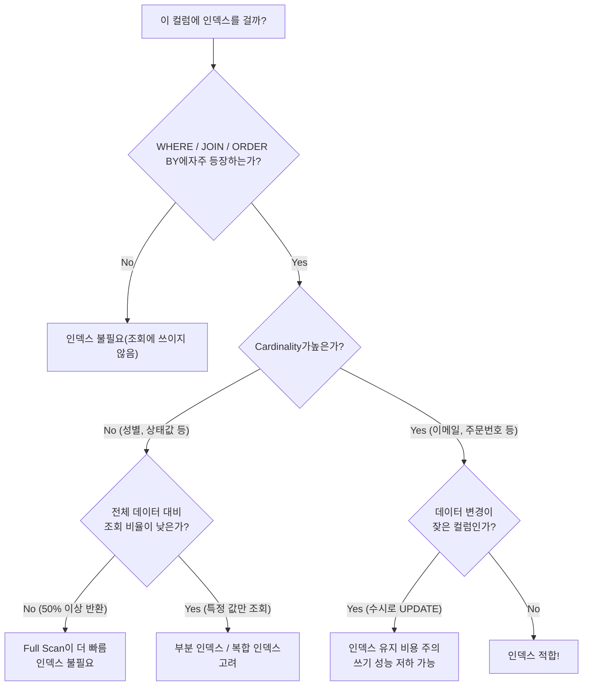
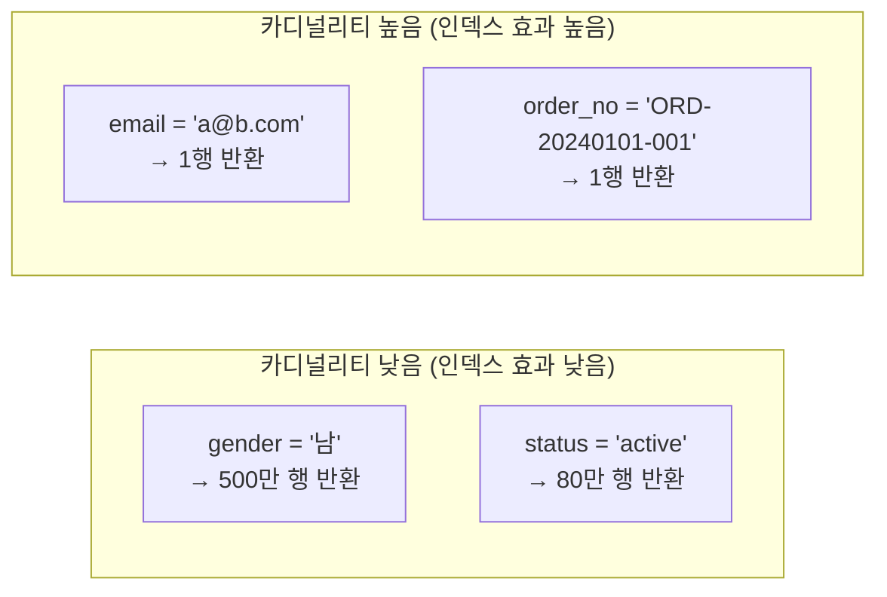
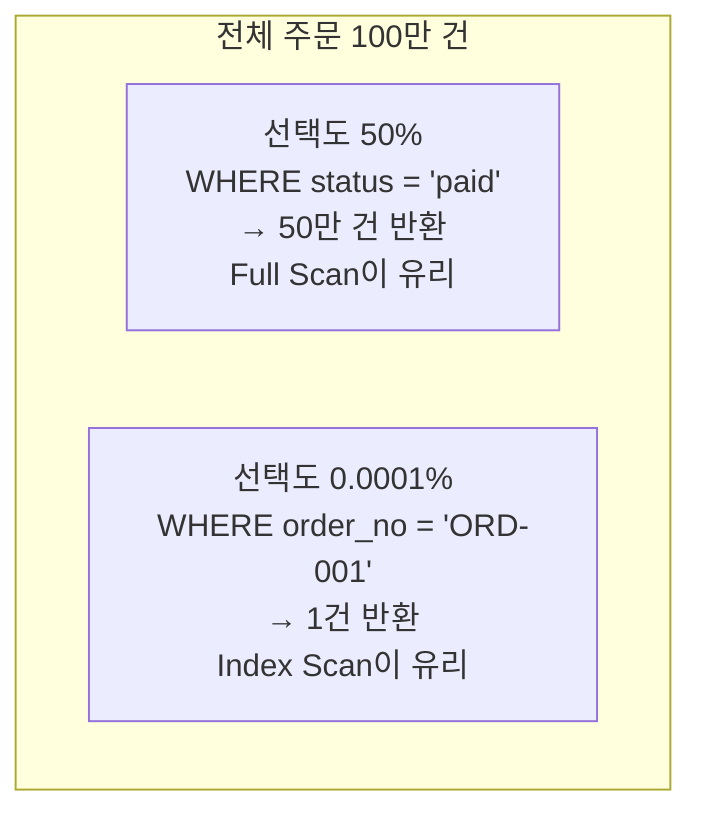
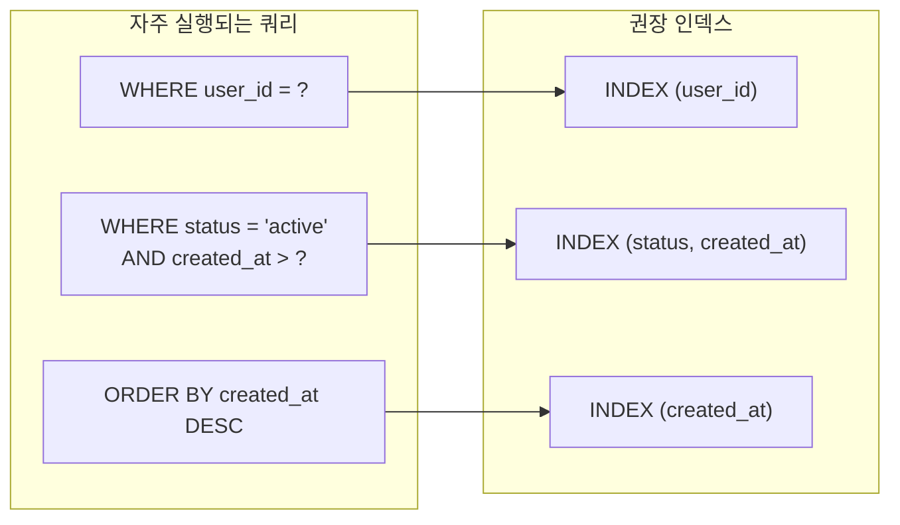
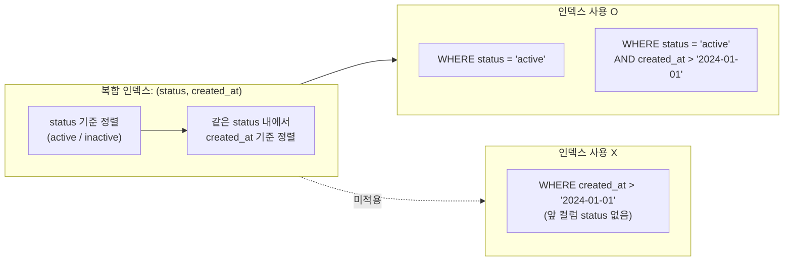
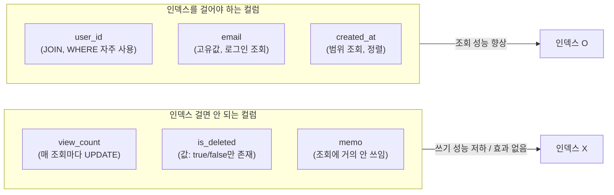
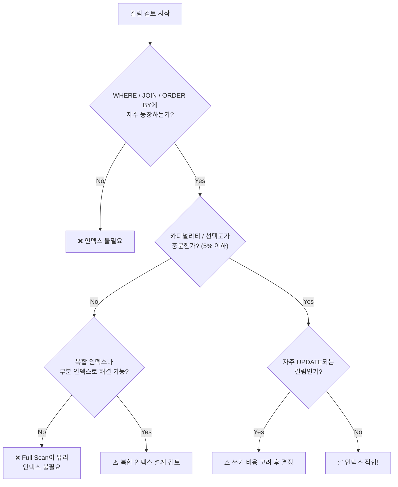

# 인덱스에 어떤 컬럼을 사용해야 할까요?

> 인덱스를 잘못 설계하면 없는 것보다 느려질 수 있습니다.
> 어떤 컬럼에 인덱스를 걸어야 하는지, 판단 기준을 정리합니다.

---

## 핵심 한 줄 요약

> **"자주 조회되고, 값이 다양하고, 변경이 적은 컬럼"** 에 인덱스를 건다.



---

## 1. 카디널리티 (Cardinality) — 값이 얼마나 다양한가

### 개념

컬럼이 가진 **고유한 값의 수**입니다.
카디널리티가 높을수록 인덱스로 좁힐 수 있는 범위가 넓어져 **탐색 효율이 좋습니다**.

### 일상 예시

> 도서관에서 책을 찾는다고 상상해봅시다.
>
> - **"언어별 분류"** 로 찾기 → 한국어/영어/일어 3가지뿐 → 여전히 수천 권을 뒤져야 함 (카디널리티 낮음)
> - **"ISBN 번호"** 로 찾기 → 모든 책마다 고유 번호 → 바로 한 권 특정 가능 (카디널리티 높음)



### 코드 예시

```sql
-- 카디널리티 확인 쿼리
SELECT
    'gender'    AS col, COUNT(DISTINCT gender)    AS cardinality, COUNT(*) AS total FROM users
UNION ALL
SELECT
    'city'      AS col, COUNT(DISTINCT city)      AS cardinality, COUNT(*) AS total FROM users
UNION ALL
SELECT
    'email'     AS col, COUNT(DISTINCT email)     AS cardinality, COUNT(*) AS total FROM users;

/*
결과 예시 (users 100만 행):
col       | cardinality | total
----------+-------------+---------
gender    |           2 | 1000000   ← 인덱스 효과 낮음
city      |         250 | 1000000   ← 보통
email     |     1000000 | 1000000   ← 인덱스 효과 높음
*/
```

---

## 2. 선택도 (Selectivity) — 인덱스가 얼마나 걸러내는가

### 개념

```
선택도 = 고유값 수 / 전체 행 수   (0 ~ 1)
```

- 선택도가 **1에 가까울수록** 인덱스가 효과적입니다.
- 선택도가 **낮을수록** (0에 가까울수록) Full Scan이 더 빠를 수 있습니다.
- 일반적으로 **5% 이하**인 컬럼에 인덱스를 권장합니다.

### 일상 예시

> 택배 회사에서 배송지를 찾는다고 상상해봅시다.
>
> - **"도 단위(경기도)"** 로 찾기 → 절반 이상의 주소가 해당 → 사실상 전부 뒤짐 (선택도 낮음)
> - **"상세 주소 + 동호수"** 로 찾기 → 딱 한 곳만 해당 → 바로 특정 가능 (선택도 높음)



### 코드 예시

```sql
-- 선택도 계산
SELECT
    column_name,
    cardinality,
    table_rows,
    ROUND(cardinality / table_rows * 100, 2) AS selectivity_pct
FROM information_schema.STATISTICS
JOIN information_schema.TABLES USING (table_schema, table_name)
WHERE table_name = 'orders'
  AND table_schema = 'mydb';

/*
column_name | cardinality | table_rows | selectivity_pct
------------+-------------+------------+----------------
status      |           5 |    1000000 |           0.00   ← 인덱스 비효율
user_id     |      800000 |    1000000 |          80.00   ← 적당
order_no    |     1000000 |    1000000 |         100.00   ← 인덱스 최적
*/
```

---

## 3. 조회 패턴 — 실제로 어떻게 쓰이는가

인덱스는 **WHERE, JOIN ON, ORDER BY, GROUP BY** 절에서 효과를 발휘합니다.
실제 쿼리 패턴을 먼저 파악하고, 자주 등장하는 컬럼에 인덱스를 겁니다.

### 일상 예시

> 회사 내부 전화번호부를 생각해봅시다.
>
> - 사람들은 주로 **"이름"** 으로 검색 → 이름에 인덱스
> - 가끔 **"부서"** 로 검색 → 부서에 인덱스 고려
> - **"입사일"** 로는 거의 안 검색 → 인덱스 불필요



### 코드 예시

```sql
-- 1. WHERE 조건에 자주 쓰이는 컬럼
-- 주문 조회: user_id로 자주 필터링
SELECT * FROM orders WHERE user_id = 1001;
CREATE INDEX idx_orders_user_id ON orders(user_id);  -- ✅

-- 2. JOIN ON 에 사용되는 컬럼
-- orders.user_id ↔ users.id 조인
SELECT o.*, u.name
FROM orders o
JOIN users u ON o.user_id = u.id;   -- 양쪽 컬럼에 인덱스가 있어야 효율적
CREATE INDEX idx_orders_user_id ON orders(user_id);  -- ✅

-- 3. ORDER BY + LIMIT (페이지네이션)
-- 최신 주문 목록 조회
SELECT * FROM orders ORDER BY created_at DESC LIMIT 20;
CREATE INDEX idx_orders_created_at ON orders(created_at);  -- ✅

-- 4. GROUP BY
-- 사용자별 주문 수 집계
SELECT user_id, COUNT(*) FROM orders GROUP BY user_id;
CREATE INDEX idx_orders_user_id ON orders(user_id);  -- ✅ (위와 동일 인덱스 재활용)
```

---

## 4. 복합 인덱스 컬럼 순서 — 어떤 컬럼을 앞에 놓을까

### 규칙

1. **등치 조건(`=`)** 컬럼을 앞에
2. **범위 조건(`>`, `<`, `BETWEEN`)** 컬럼을 뒤에
3. 카디널리티가 높은 컬럼을 앞에

### 일상 예시

> 도서관 책 분류를 생각해봅시다.
>
> - **(장르 → 작가명 → 제목)** 순으로 분류하면 장르 안에서 작가명으로 좁히고, 다시 제목으로 좁힐 수 있습니다.
> - 만약 **(제목 → 장르)** 순이면 제목 없이 장르만으로는 찾을 수 없습니다.
>
> 복합 인덱스도 **왼쪽 컬럼부터 순서대로** 사용해야 효과가 있습니다. (**Leftmost Prefix 규칙**)



### 코드 예시

```sql
-- 잘못된 인덱스 순서 (범위 조건이 앞에)
CREATE INDEX idx_bad ON orders(created_at, status);
-- created_at 범위를 먼저 걸면 status 인덱스가 사실상 무력화됨

-- 올바른 인덱스 순서 (등치 조건 앞, 범위 조건 뒤)
CREATE INDEX idx_good ON orders(status, created_at);

-- 이 쿼리에서 idx_good은 효과적으로 동작
SELECT * FROM orders
WHERE status = 'paid'           -- status로 먼저 좁히고
  AND created_at > '2024-01-01' -- 그 안에서 created_at으로 범위 탐색
ORDER BY created_at DESC;

-- EXPLAIN으로 확인
EXPLAIN SELECT * FROM orders
WHERE status = 'paid' AND created_at > '2024-01-01';
-- type: range, key: idx_good  → 인덱스 정상 사용
```

---

## 5. 인덱스를 피해야 하는 컬럼

모든 컬럼에 인덱스를 거는 것은 오히려 **쓰기 성능을 저하**시킵니다.

### 인덱스를 걸지 말아야 할 경우

| 상황 | 이유 | 예시 |
|------|------|------|
| 카디널리티가 매우 낮은 컬럼 | 결과를 거의 좁히지 못함 | `gender`, `is_deleted` |
| 자주 UPDATE되는 컬럼 | 변경마다 인덱스 재정렬 비용 발생 | `last_login_at`, `view_count` |
| 조회에 거의 사용되지 않는 컬럼 | 공간 낭비 + 쓰기 성능 저하 | `memo`, `remark` |
| 데이터가 매우 적은 테이블 | Full Scan이 더 빠름 | 코드 테이블(수십 행) |

### 일상 예시

> 쇼핑몰 상품 테이블에서 `view_count`(조회수) 컬럼에 인덱스를 건다고 가정합니다.
>
> - 상품 조회 페이지를 열 때마다 `view_count`가 1씩 증가합니다.
> - 인덱스가 있으면 **매 조회마다 인덱스도 재정렬** → 인기 상품일수록 더 심각한 쓰기 병목 발생합니다.
> - `view_count`는 인덱스 없이, 필요하면 별도 캐시 서버(Redis)에서 관리하는 것이 낫습니다.

```sql
-- ❌ 잘못된 설계: 자주 변경되는 컬럼에 인덱스
CREATE INDEX idx_view_count ON products(view_count);
-- 상품 조회 시마다 INSERT INTO → 인덱스 재정렬 → 쓰기 병목

-- ✅ 올바른 설계: 조회 필터에 사용되는 컬럼에만 인덱스
CREATE INDEX idx_products_category ON products(category_id);
CREATE INDEX idx_products_price    ON products(price);
-- view_count는 Redis 등 별도 캐시에서 관리
```



---

## 정리: 인덱스 컬럼 선택 체크리스트



| 기준 | 인덱스 적합 | 인덱스 부적합 |
|------|-----------|-------------|
| 카디널리티 | 높음 (이메일, 주문번호) | 낮음 (성별, 상태값) |
| 선택도 | 5% 이하 | 10% 초과 |
| 조회 빈도 | WHERE/JOIN에 자주 등장 | 거의 사용 안 됨 |
| 변경 빈도 | 낮음 (정적 데이터) | 높음 (수시 UPDATE) |
| 데이터 규모 | 대용량 테이블 | 수십~수백 행 소규모 |
