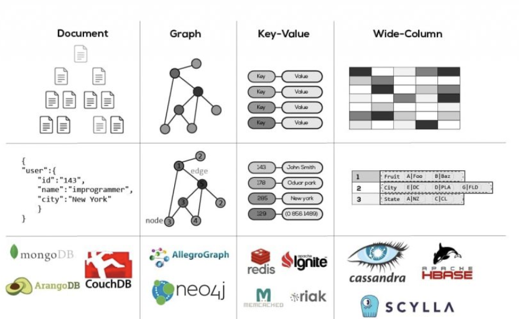

<h2>대표적인 NoSQL은 무엇이 있나요?</h2>

> NoSQL은 저장 방식에 따라 크게 4가지 유형으로 분류된다.
>
> 첫째, Key-Value 저장소다. 키와 값 쌍으로 데이터를 저장하는 가장 단순한 형태이며, 대표적으로 Redis와 DynamoDB가 있다. 주로 캐싱이나 세션 저장용으로 많이 쓰인다.
>
> 둘째, Document 저장소다. JSON이나 BSON 형태로 문서를 저장하며, 대표적으로 MongoDB가 있다. 스키마가 유연해서 구조가 자주 바뀌는 데이터에 적합하다.
>
> 셋째, Column-Family(Wide Column) 저장소다. 행 단위가 아닌 컬럼 단위로 데이터를 저장하며, Cassandra와 HBase가 대표적이다. 대용량 데이터의 분산 저장과 빠른 쓰기에 강점이 있다.
>
> 넷째, Graph 데이터베이스다. 노드와 관계(엣지)로 데이터를 저장하며, 대표적으로 Neo4j가 있다. SNS 친구 관계, 추천 시스템처럼 관계 중심 데이터에 적합하다.
>
> 각각 용도가 다르기 때문에, 서비스 특성에 맞춰 선택하는 것이 중요하다. 예를 들어 사용자 세션은 Redis, 게시글 같은 반정형 데이터는 MongoDB, 로그성 대용량 데이터는 Cassandra를 쓰는 식이다.



<h3>NoSQL이 등장한 배경</h3>
2000년대 들어 SNS, 전자상거래, 로그 시스템 등에서 데이터가 폭증하기 시작했다. 기존 RDB로는 다음과 같은 한계가 있었다.

- 수평 확장(Scale-Out)이 어려움
    
    RDB는 서버를 늘리는 대신 서버 스펙을 올리는 수직 확장(Scale-Up)에 의존한다

- 스키마 변경 비용이 큼

    컬럼 하나 추가하려면 테이블 전체를 건드려야 한다

- Join 연산이 느려짐

    데이터가 많아질수록 성능이 급격히 떨어진다

<h3>NoSQL의 4가지 유형</h3>
1. Key-Value Store
    ```sql
   "user:1001" → { name: "홍길동", age: 30 }
    "session:abc" → "logged_in"
    "cart:123"    → ["item1", "item2", "item3"]
   ```
   가장 단순한 구조다. 키로 값을 조회하는 것만 가능하며, 복잡한 쿼리는 안 된다. 대신 엄청나게 빠르다.
   - Redis: 인메모리 기반, 캐시/세션/실시간 랭킹에 최적 
   
   - DynamoDB: AWS 관리형 서비스, 자동 확장
   
   - Memcached: 순수 캐시 용도


2. Document Store
    ```sql
   {
    "_id": "1001",
    "name": "홍길동",
    "posts": [
    { "title": "첫 글", "likes": 10 },
    { "title": "둘째 글", "likes": 5 }
    ],
    "address": { "city": "서울", "zip": "12345" }
    }
   ```    
   JSON/BSON 형태로 중첩 구조를 그대로 저장할 수 있다. RDB라면 여러 테이블로 쪼개서 Join해야 할 데이터를 한 문서로 묶을 수 있다.

    - MongoDB: 가장 대중적, 다양한 쿼리 지원

    - CouchDB: REST API 기반

    - Elasticsearch: 검색에 특화된 Document DB
   

3. Column-Family Store
    ```
   Row Key: user_1001
    ├── name: "홍길동"
    ├── email: "hong@example.com"
    └── last_login: "2026-04-20"
    
    Row Key: user_1002
    ├── name: "김철수"
    └── phone: "010-1234-5678"  ← 행마다 컬럼 구성이 달라도 됨
    ```
   RDB가 "행" 단위로 데이터를 저장한다면, Column-Family는 "컬럼" 단위로 저장한다.

   대용량 분산 환경에서 쓰기 성능이 뛰어나다. 로그, 시계열 데이터, IoT 센서 데이터 같은 곳에 적합하다.

    - Cassandra: 페이스북이 개발, 무중단 확장에 강함
    
    - HBase: 하둡 생태계, 빅데이터 분석용
    
    - ScyllaDB: Cassandra 호환, 더 빠름


4. Graph Database
    ```
   [홍길동] ---친구--- [김철수]
   |                    |
    구매                  좋아요
    ↓                    ↓
    [아이폰] ←---추천--- [갤럭시]
   ```
   데이터를 노드(Node)와 관계(Edge)로 표현한다. "친구의 친구의 친구"같은 다단계 관계 탐색이 RDB보다 훨씬 빠르다.

    - Neo4j: 가장 대표적인 그래프 DB
    - Amazon Neptune: AWS 관리형 그래프 DB
    - 활용 예: 페이스북 친구 추천, 링크드인 인맥 검색, 부정 거래 탐지