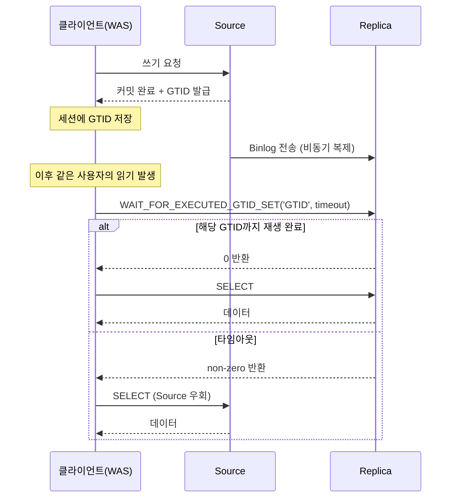
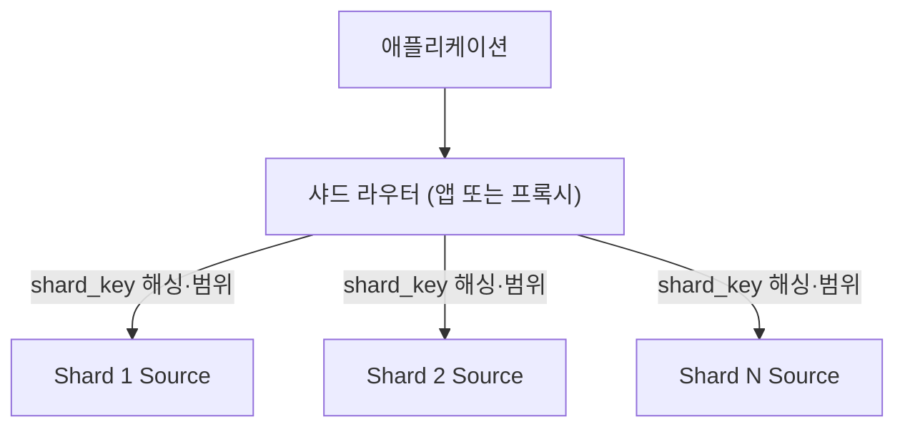
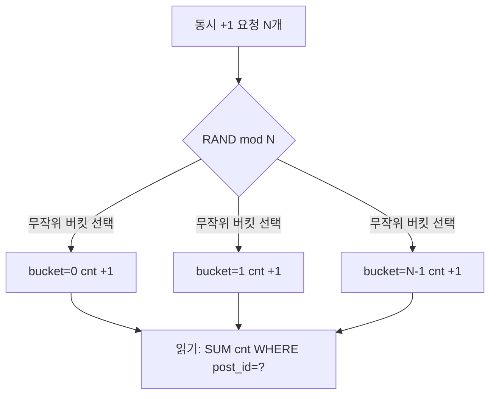

# 대용량 데이터 모델링 및 수평 확장

단일 DB·단일 테이블에 데이터가 수억 건 쌓이고 쓰기 TPS가 한계에 부딪힐 때 필요한 전략을 정리한다.

## 파티셔닝(Partitioning)

파티셔닝은 논리적으로 하나인 테이블을 물리적으로 여러 파티션으로 나눠 저장하면서, 애플리케이션은 파티션을 의식하지 않고 동일한 SQL로 접근하는 기능이다.

- MySQL 8.0은 InnoDB 위에서 네이티브 파티셔닝을 기본 제공
- 각 파티션은 독립된 `.ibd` 테이블스페이스 파일로 존재

### 파티션 키

파티션 키는 어떤 행을 어느 파티션에 저장할지를 결정하는 컬럼(또는 컬럼 조합)으로, `CREATE TABLE`의 `PARTITION BY <타입>(<컬럼 표현식>)` 구문에 지정한다.

- 표현식 허용: `PARTITION BY RANGE (YEAR(created_at))`처럼 컬럼에 함수를 적용한 결과도 키로 사용 가능
- 타입 제약: 기본 RANGE·HASH·LIST는 결과가 정수여야 하며, 날짜·문자열 원시값으로 나누려면 `RANGE COLUMNS`·`LIST COLUMNS` 구문 사용
- 다중 컬럼: `PARTITION BY RANGE COLUMNS (region, created_at)`처럼 복수 컬럼 조합도 허용
- 불변성: 파티션 키 자체는 정의 시 확정, 변경하려면 `ALTER TABLE ... PARTITION BY`로 테이블 전체 재구성 필요

### 세컨더리 인덱스 구조

MySQL은 세컨더리 인덱스를 파티션별 로컬 B+Tree로만 관리하며, 파티션 경계를 가로지르는 글로벌 세컨더리 인덱스는 지원하지 않는다.

- 파티션 키가 아닌 조건 조회 시 모든 파티션의 로컬 인덱스를 각각 탐색
- 파티션 갯수 만큼 N배 비용 발생

### Partition Pruning

옵티마이저가 WHERE 조건을 분석해 관련 파티션만 읽도록 대상을 줄이는 최적화인 Partition Pruning가 존재하여, 대량 데이터에서도 빠르게 필요한 파티션만 스캔할 수 있다.

```text
 orders (Range Partition by created_at)
   ├── p_2024_01  [2024-01-01 ~ 2024-01-31]
   ├── p_2024_02  [2024-02-01 ~ 2024-02-29]
   ├── p_2024_03  [2024-03-01 ~ 2024-03-31]
   └── p_current  [그 이후]

 SELECT * FROM orders WHERE created_at >= '2024-02-15'
   → 옵티마이저가 p_2024_02, p_2024_03, p_current만 스캔
```

Partition Pruning이 동작하려면 WHERE 절에 파티션 키가 연산 없이 들어와야 한다.(`YEAR(created_at) = 2024`처럼 함수로 감싸면 Pruning 실패)

### 타입별 선택 기준

|  타입   |     분할 기준     |                      장점                      |           주의            |    대표 용도     |
|:-----:|:-------------:|:--------------------------------------------:|:-----------------------:|:------------:|
| Range | 연속된 범위(날짜·ID) | 시계열 Pruning 명확, `DROP PARTITION`으로 초 단위 아카이빙 |     최신 파티션에 Hotspot     |  주문·로그성 시계열  |
| Hash  |  파티션 키의 해시값   |                 쓰기 I/O 균등 분산                 |    범위 쿼리 시 전 파티션 스캔     |  균등 분산이 최우선  |
| List  |   명시적 값 집합    |                도메인 축으로 물리 격리                 | 정의에 없는 값 유입 시 INSERT 에러 | 국가 코드·서비스 상태 |
|  Key  |   내장 해시 함수    |                문자열 키에도 적용 가능                 |   Hash와 동일한 범위 쿼리 제약    |  정수가 아닌 PK   |

---

## DB 복제(Replication)

복제는 Source(Master)에서 발생한 변경을 Binlog로 Replica(Slave)에 전송하고, Replica가 이를 재생해 동일한 상태를 유지하는 구조다.

- MySQL은 기본적으로 비동기 복제를 채택
- Source는 Replica의 수신 여부와 무관하게 커밋 완료

### 복제 아키텍처

복제를 구성하는 핵심 요소는 Binlog 포맷, 두 개의 스레드, 그리고 트랜잭션 식별 방식이다.

- Binlog 포맷: STATEMENT / ROW / MIXED 중 선택 (아래 표 비교)
- 복제 스레드 구성
    - IO Thread: Source의 Binlog를 네트워크로 읽어 Replica의 Relay Log에 기록
    - SQL Thread: Relay Log를 읽어 실제 데이터 변경을 적용

```text
 Source                              Replica
 ┌──────────┐      Binlog        ┌──────────┐
 │ COMMIT   │──────────────────▶ │Relay Log │
 │ Binlog   │                    │    │     │
 └──────────┘                    │    ▼     │
                                 │SQL Thread│ ← 재생(Replay)
                                 └──────────┘
```

|    포맷     |           기록 내용           |                        재생 안전성                         |     기본값      |
|:---------:|:-------------------------:|:-----------------------------------------------------:|:------------:|
| STATEMENT |       실행 SQL 문장 자체        | 비결정 함수(`NOW()`·`UUID()`)에서 Source·Replica 값이 달라질 수 있음 |     구 버전     |
|    ROW    |        변경된 행 단위 값         |               비결정 함수·트리거 있어도 일관된 재생 보장                | MySQL 8.0 기본 |
|   MIXED   | 평소 STATEMENT, 비결정 상황만 ROW |                     상황에 맞춰 자동 전환                      |  레거시 호환 필요시  |

### Replication Lag

Replication Lag는 Source에서 커밋된 시각과 Replica에서 재생이 완료된 시각의 차이로, 주요 원인은 다음과 같다.

- 단일 스레드 Replay: 과거 MySQL의 기본 동작으로, 긴 트랜잭션 하나가 SQL Thread 전체를 블로킹
- 긴 트랜잭션·대량 UPDATE: Source에서 10분 걸린 배치는 Replica에서도 10분간 재생
- 네트워크·디스크 병목: Replica 하드웨어가 Source의 TPS를 따라가지 못하는 경우

해결 방향은 MySQL 8.0의 병렬 재생 기능과 하드웨어 동등성 확보에 집중된다.

- `binlog_format=ROW` 고정으로 SQL 재파싱 비용 제거
- 트랜잭션 병렬 재생
- Replica 하드웨어 사양을 Source와 동등 이상으로 유지
- 긴 배치는 청크 단위로 쪼개 재생 시간 평탄화

### Read-After-Write 문제

Source-Replica 분리의 대표적인 부작용으로, 복제 지연 탓에 재생이 끝나지 않아 방금 쓴 데이터가 안 보이는 버그가 발생한다.

- 직후 Source 라우팅: 쓴 직후 일정 시간 동안 해당 사용자의 읽기를 Source로 고정
    - 구현은 단순하지만 복제 지연이 설정한 시간보다 길어지면 같은 버그 재발
- GTID 대기: 쓰기 응답의 GTID를 세션에 저장하고, `WAIT_FOR_EXECUTED_GTID_SET`로 Replica 재생 확인 후 읽기
    - 정확도가 가장 높고, 대기 타임아웃 시 Source 읽기로 우회 가능
- Semi-Sync(반동기 복제): Source가 커밋 전에 Replica 수신 ACK를 받도록 강제, 쓰기 지연이 큼
    - 모든 쓰기가 Replica 왕복만큼 느려지지만 데이터 손실이 사실상 0(RPO=0)

#### GTID 대기 동작 흐름

1. Source 커밋 시 해당 트랜잭션에 고유 번호(GTID, 형식 `server_uuid:tx_id`)가 발급되어 Binlog에 기록
2. 클라이언트(WAS)가 쓰기 응답에서 받은 GTID를 사용자 세션에 저장
3. 이후 해당 사용자의 읽기 전, Replica에 `SELECT WAIT_FOR_EXECUTED_GTID_SET('<GTID>', <timeout>)` 실행
4. 반영 완료 → Replica에서 SELECT / 미반영 → 타임아웃까지 대기, 그래도 안 오면 Source로 읽기



---

## DB 샤딩(Sharding)

샤딩은 데이터를 여러 DB 서버에 나눠 저장하고, 각 요청을 적절한 샤드로 라우팅해 단일 DB의 쓰기 한계를 넘기는 수평 분할 전략이다.

- 애플리케이션 레이어 라우팅: 애플리케이션 코드에서 샤드 매핑과 라우팅 로직을 직접 구현
- 미들웨어: 프록시 서버(Vitess, ProxySQL, ShardingSphere 등)가 샤드 매핑과 라우팅을 담당

MySQL 자체에는 샤딩 기능이 없어 외부 계층에서 구현한다.



### 샤드 키 선정 기준

샤드 키는 모든 쿼리가 어느 샤드로 갈지 결정하는 기준이며, 한 번 정하면 Resharding 없이는 변경할 수 없다.

- 높은 카디널리티: `user_id` 적합 / `country` 소수 샤드 쏠림 위험 존재
- 균등한 분포: 특정 사용자가 트래픽의 대부분을 차지하면 핫 샤드 발생

### Hash vs Range 샤딩

샤드 배정 방식은 Hash와 Range 두 가지이며, 쿼리 패턴에 따라 맞는 쪽이 다르다.

- Hash: `user_id % N` 또는 해시 함수로 샤드 결정
    - 쓰기 분산은 자연스러우나 범위 쿼리는 모든 샤드 스캔 필요
- Range: `user_id 1~100만 → 샤드1, 100만~200만 → 샤드2`
    - 범위 쿼리는 특정 샤드로 국한되지만 최신 데이터가 한 샤드에 몰림

### 샤드를 넘는 조인·트랜잭션

샤드가 분리되면 SQL 한 번으로 샤드 간 조인이나 분산 트랜잭션을 처리할 수 없고, 아래 방식으로 우회한다.

- 애플리케이션 레벨 조인: 샤드별로 각각 조회한 뒤 서비스 레이어에서 합치기
- 조회용 비정규화 테이블: 자주 함께 읽는 데이터는 별도 조회 전용 저장소에 중복 저장

---

## 비정규화(Denormalization)

정규화는 데이터 중복과 갱신 이상 현상을 막지만, 대규모 쿼리 처리 시에는 조회마다 조인 N번 + 집계 형태가 많아져 성능이 떨어질 수 있다.

### 적용 타이밍

비정규화는 무조건 이득이 아니며, 다음 조건이 모두 성립할 때 실익이 생긴다.

- 읽기 QPS가 쓰기 QPS를 압도
- 조회 경로의 정형화

### 대표 패턴

- 집계 컬럼: `post.like_count`를 매번 `COUNT(*)`하는 대신 컬럼으로 유지
- 참조 복사: `order.user_name`처럼 조인 없이 바로 보여줄 정보를 복사
- 조회 전용 테이블: `order_summary`처럼 대시보드용 집계본을 주기 갱신

### 동기화 방법

- 애플리케이션 이벤트: 비즈니스 로직에서 원본과 복사본을 함께 업데이트
- 트리거: DB 레벨 자동 처리, 디버깅 난이도·벤더 종속
- CDC(Change Data Capture): Binlog를 구독해 변경을 이벤트로 전파

---

## 질문 예시

### Q1. Range 파티셔닝과 비-파티션 키 조회

> 5년치 주문 데이터 10억 건이 쌓인 테이블에 월 단위 Range 파티셔닝을 적용했다.  
> `WHERE created_at BETWEEN ...`은 빨라지지만, `WHERE user_id = ?`는 왜 오히려 느려질 수 있는가?  
> 이 경우 Partition Pruning 대신 어떤 전략이 필요한가?

`user_id`는 파티션 키가 아니므로 옵티마이저가 대상 파티션을 좁힐 수 없다.

- 60개 월별 파티션을 전부 스캔 대상에 포함
- 각 파티션의 `(user_id)` 로컬 세컨더리 인덱스를 60번 탐색
- B+Tree 1회면 끝날 조회가 파티션 수만큼 곱해짐

원인은 MySQL 파티셔닝이 글로벌 세컨더리 인덱스를 지원하지 않기 때문이며, 우회는 두 가지다.

- 쿼리 패턴 조정: `WHERE user_id = ? AND created_at >= ?`로 파티션 키를 함께 실어 Pruning과 인덱스를 같이 활용
- 조회 전용 비정규화: 별도 테이블(`user_orders_recent`)을 두고 `user_id`로 직접 타도록 구성

### Q2. 결제 직후 조회 실패

> Source-Replica 구조에서 결제 직후 마이페이지 조회가 "결제 내역이 안 보인다"는 버그가 발생했다.  
> 세 가지 해결 패턴(직후 Source 라우팅 / GTID 대기 / Semi-Sync) 중 무엇을 선택할 것이며, RPO·UX 측면의 고려는?

- 직후 Source 라우팅: 쓴 직후 일정 시간 동안은 해당 사용자의 읽기를 Replica 대신 Source로 직접 보내는 방식
    - 구현이 단순하고 쓰기가 느려지지 않지만, "일정 시간"을 얼마로 잡을지 애매
    - 복제 지연이 이 시간보다 길어지면 같은 버그가 다시 발생
- GTID 대기: 쓰기 응답에 딸려 오는 트랜잭션 ID(GTID)를 세션에 들고 있다가, Replica가 그 지점까지 재생을 끝냈는지 확인한 뒤 Replica에서 읽기
    - 정확도가 가장 높고, 대기가 타임아웃 나면 Source로 돌려 읽는 방식으로 자연스럽게 퇴화
- Semi-Sync(반동기 복제): Source가 커밋을 완료하기 전에 최소 1대 이상의 Replica가 해당 변경을 수신했다는 응답을 받도록 강제
    - Source가 죽어도 데이터 손실이 사실상 0에 가까움(RPO=0), 대신 모든 쓰기가 Replica 왕복 시간만큼 느려짐

#### 도메인별 선택

- 결제·정산(단 한 건의 손실도 허용할 수 없는 경우): Semi-Sync + GTID 대기를 겹쳐 방어
- 댓글·좋아요(사용자 체감 속도가 더 중요한 경우): 직후 Source 라우팅으로 충분

### Q3. 댓글 테이블의 샤드 배치

> 사용자 ID를 샤드 키로 골랐는데 "A 사용자가 B 사용자의 게시물에 단 댓글 목록"이 샤드를 넘나드는 쿼리가 됐다.  
> 어떤 테이블을 어떻게 재설계할 것인가? 댓글은 어느 샤드에 둘 것인가?

샤드 키는 읽기 패턴에 맞춰 결정한다.

- 게시물 상세 읽기가 지배적이면 댓글을 `post_id` 샤드에 배치, 단일 샤드 조회로 성립
- 사용자 관점 읽기도 필요하면 샤드 키가 다른 테이블 두 개를 두고 CDC로 동기화

#### 중복 저장 예시

- `comments_by_post`(샤드 키: post_id) — 게시물 상세용
- `comments_by_user`(샤드 키: user_id) — 마이페이지용
- 동기화: Binlog → Debezium → Consumer 파이프라인, 최종 일관성 허용

### Q4. 좋아요 카운터의 동시성

> 게시물 좋아요 수를 매 요청마다 `COUNT(*)`로 계산하던 것을 `post.like_count` 컬럼으로 바꿨다.  
> 인기 게시물에서 동시 좋아요 1000건이 발생할 때 정합성과 성능을 모두 지키려면?  
> Redis 카운터로 분리하면 어떤 비용이 생기는가?

`UPDATE posts SET like_count = like_count + 1 WHERE id = ?`는 같은 행에 쓰기 잠금(X 락)을 걸기 때문에, 여러 요청이 동시에 들어와도 하나씩 순서대로만 처리된다.

- 1000개 요청이 앞 트랜잭션의 커밋을 기다리며 줄을 서게 됨
- 인기 게시물 하나가 DB 연결(커넥션 풀)을 통째로 차지해 다른 요청까지 지연

#### 단일 DB 안에서 완화하는 방법

- Counter Sharding(카운터 분산): 좋아요 수를 한 행에 몰지 않고 `post_like_counts(post_id, bucket, cnt)` 형태로 N개 행에 나눠 저장
    - 쓸 때는 무작위 버킷(`RAND() % N`)에 `+1`, 읽을 때는 N개 행 값을 합산해 최종 카운트 산출
    - 같은 게시물이라도 락이 N개로 쪼개져 경쟁이 1/N 수준으로 감소
- 비동기 집계: 좋아요 한 건마다 `like_events` 테이블에 행을 추가만 하고, 별도 배치 작업이 주기적으로 `posts.like_count` 값을 갱신
    - 즉시 반영은 아니지만, 쓰기 경로에서 락 경쟁이 사라짐

Counter Sharding 동작 구조



#### Redis로 카운터를 분리할 때의 비용

- 정합성 분리: Redis의 증가 명령(`INCR`)으로 바로 올라가지만, DB에는 배치로 나중에 쓰이므로 두 저장소의 값이 잠깐 달라질 수 있음
- 유실 리스크: Redis 장애 시 디스크 백업 설정(RDB/AOF)에 따라 수 초~수 분치 카운터가 날아갈 수 있음
- 운영 복잡도: 두 저장소 값이 어긋났을 때 맞추는 보정 로직, 배치 실패 시 재시도와 누락분 다시 채우기(백필) 전략 필요
