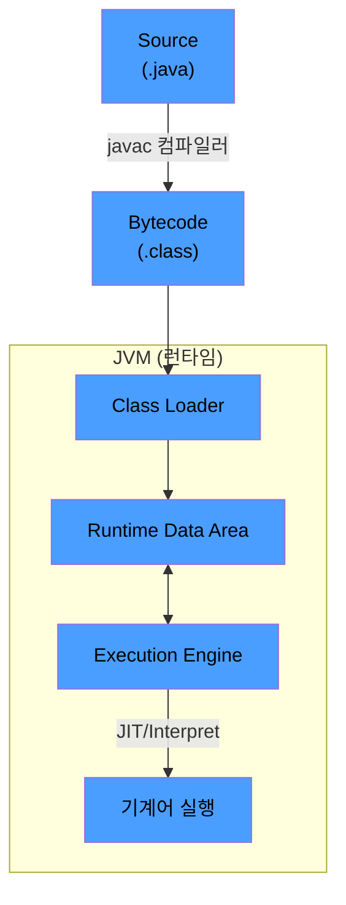

# JDK, JRE, JVM 차이와 자바 실행 흐름

자바를 사용한다는 말은 세 가지 서로 다른 도구 묶음을 가리킨다.

- JVM (Java Virtual Machine): 바이트 코드(`.class`)를 실제 기계어로 변환하여 실행하는 가상 머신
- JRE (Java Runtime Environment) = JVM + 표준 라이브러리: 실행만 가능
- JDK (Java Development Kit) = JRE + 개발 도구(`javac`, `javadoc`, `jdb` 등): 개발과 실행 모두 가능

|      구분      |     JVM     |   JRE    |  JDK   |
|:------------:|:-----------:|:--------:|:------:|
|   자바 코드 실행   |      O      |    O     |   O    |
| 표준 라이브러리 포함  |      X      |    O     |   O    |
| 컴파일러 등 개발 도구 |      X      |    X     |   O    |
|      용도      | 바이트코드 해석/실행 | 운영 서버 배포 | 개발자 로컬 |

이 포함 관계 덕분에 운영 서버에는 JRE만 두고, 개발자 로컬에는 JDK를 설치하는 분리가 가능하다.

## 소스 코드에서 실행까지의 전체 흐름

자바 소스가 실제 기계어로 실행되기까지 컴파일 시점에 한 번, 실행 시점에 두 단계의 변환을 거친다.

1. 컴파일 (빌드 시점): `javac`이 `.java` 소스를 플랫폼 독립적인 바이트코드(`.class`)로 변환
2. 클래스 로딩 (실행 시점): Class Loader가 필요한 `.class` 파일을 메모리(Runtime Data Area)로 적재
3. 실행 엔진 동작: 인터프리터가 바이트코드를 한 줄씩 해석하거나, JIT 컴파일러가 핫스팟을 네이티브 코드로 컴파일하여 실행

### Execution Engine 수행 방식

클래스 로더가 메모리에 올린 바이트코드는 두 가지 방식 중 하나로 실행된다.

- 인터프리터 (Interpreter): 바이트코드를 한 줄씩 해석하여 즉시 실행
    - 시작은 빠르지만, 동일 코드를 반복 실행할 때마다 매번 해석하므로 비효율
- JIT 컴파일러 (Just-In-Time): 반복 실행되는 핫스팟 코드를 네이티브 기계어로 변환하여 캐시
    - 캐시된 코드는 다음 호출부터 인터프리트 없이 직접 실행되어 성능 대폭 향상

## 2단계 컴파일이 필요한 이유

C/C++은 소스에서 네이티브 바이너리로 한 번에 컴파일되는데, 자바는 중간 단계를 두어 아래와 같은 이점을 얻을 수 있게 되었다.

- 플랫폼 독립성 확보: `.class` 파일은 OS·CPU에 종속되지 않으며, 해당 플랫폼용 JVM만 있으면 그대로 실행
- WORA (Write Once, Run Anywhere): 동일한 `.class` 파일을 Windows·Linux·macOS에서 수정 없이 실행
- 트레이드오프 보완: 네이티브로 직접 컴파일된 코드보다 실행 속도는 느림 → JIT 컴파일러로 보완

## Class Loader의 단계별 동작

클래스 로더는 `.class` 파일을 단순히 메모리에 올리는 것이 아니라, 검증과 초기화를 거쳐 실행 가능한 상태로 만든다.

1. 로딩 (Loading): `.class` 파일을 찾아 바이트코드를 메모리로 적재
    - 동적 로딩이 기본 — 모든 클래스를 한 번에 올리지 않고 실제 참조 시점에 로드
    - `static` 멤버도 호출 시점에 클래스가 동적으로 로드
2. 링크 (Linking): 읽어온 코드를 실행 가능하도록 준비
    - 검증 (Verify): 바이트코드가 자바 언어 명세 및 JVM 명세를 준수하는지 확인 (보안)
    - 준비 (Prepare): 정적 변수 메모리 할당 + 기본값(0, false, null)으로 초기화
    - 분석 (Resolve): `.class`에 이름(문자열)으로만 적힌 참조를 클래스 로드 후 실제 메모리 주소(직접 참조)로 연결
        - 컴파일 시점에는 적재 위치를 알 수 없어 이름만 적어두고 런타임에 연결하는 구조
3. 초기화 (Initialization): 정적 변수에 명시된 실제 값과 `static` 블록 실행

## 동적 로딩과 첫 호출 비용

앞의 단계들(로딩 + 검증·준비·분석 + 초기화)은 빌드 시점이 아니라 실행 중에 일어나며, 클래스 로더는 처음 참조되는 순간 수행하는 lazy한 방식으로 동작한다.

- 첫 사용 시: 디스크 I/O → Verify → Prepare → Resolve → Initialize가 한꺼번에 발생
- 두 번째부터: 이미 메모리에 적재되어 있고 Resolve 결과도 캐시되어 있어 즉시 실행
