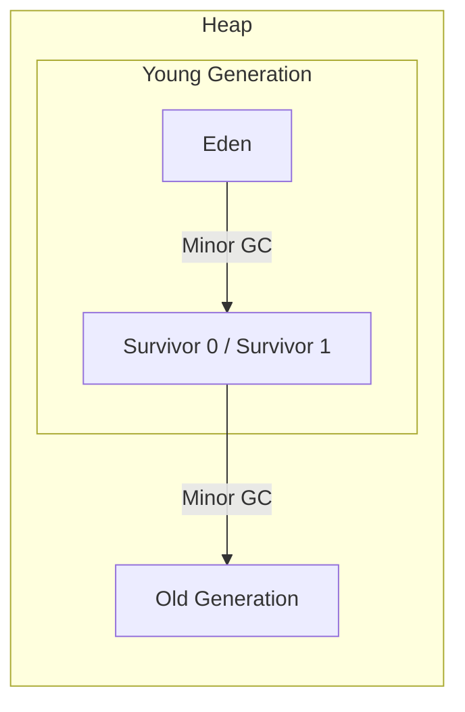
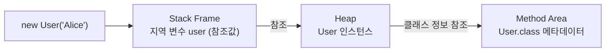

# JVM Runtime Data Area

JVM은 자바 프로그램을 실행하기 위해 OS로부터 받은 메모리를 용도별로 분할해 관리하며, 이렇게 나뉜 메모리 묶음을 Runtime Data Area라 한다.

이렇게 영역을 나누는 이유는 세 가지다.

- 스레드 격리: 메서드 호출 컨텍스트는 스레드마다 다르므로 Stack을 스레드별로 두어 락 없이 안전하게 접근
- 단일 진실 원천: 클래스 메타데이터·바이트코드는 모든 스레드가 동일한 정의를 봐야 하므로 Method Area 한 곳에 두고 공유
- GC 대상 분리: 객체 인스턴스를 별도 영역(Heap)에 모아두고 가비지 컬렉터가 회수

각 영역은 스레드 공유 여부에 따라 두 그룹으로 나뉜다.

- 스레드 공유 영역: Method Area, Heap → 모든 스레드가 함께 접근
- 스레드 독립 영역: Stack, PC Register, Native Method Stack → 스레드마다 개별 할당

|         영역          |             저장 대상              |    생명 주기    | 스레드 공유 |
|:-------------------:|:------------------------------:|:-----------:|:------:|
|     Method Area     | 클래스 메타데이터, 정적 변수, 상수 풀, 메서드 코드 | JVM 시작 ~ 종료 |   O    |
|        Heap         |          객체 인스턴스, 배열           |   GC가 관리    |   O    |
|        Stack        |    메서드 호출 프레임, 지역 변수, 매개변수     |  메서드 종료 시   |   X    |
|     PC Register     |        현재 실행 중인 명령어 주소         |  스레드 종료 시   |   X    |
| Native Method Stack |     네이티브(C/C++) 메서드 호출 프레임     |  스레드 종료 시   |   X    |

## 스레드 공유 영역

### Heap

`new` 키워드로 생성된 모든 객체와 배열이 저장되는 영역으로, 가비지 컬렉션의 주된 대상이다.

- 성능 최적화를 위해 Young Generation(Eden + Survivor 0/1)과 Old Generation으로 나뉘어 세대별로 관리
- 메모리 부족 시 `OutOfMemoryError: Java heap space` 발생
- 모든 스레드가 동일 객체를 참조할 수 있으므로 동시성 제어 필요



### Method Area

클래스의 구조 정보(필드, 메서드 시그니처)와 정적 변수, 상수 풀(Runtime Constant Pool), 메서드 바이트코드가 저장되는 영역.

- 힙 바깥의 네이티브 메모리(Metaspace)에 위치 → OS 메모리 한도 내에서 동적 확장 (과거 PermGen의 고정 한도 제약을 해소한 구조)
- 한도 초과 시 `OutOfMemoryError: Metaspace` 발생

### String Constant Pool

문자열 리터럴(`"hello"`)을 저장하는 특별한 영역으로, 동일한 문자열이 중복 저장되지 않도록 JVM이 관리하는 캐시다.

- Heap에 위치 → 사용되지 않는 문자열은 GC로 회수
- `String s = "hello"`: 풀에 저장된 인스턴스를 그대로 참조
- `new String("hello")`: 풀과 별개로 Heap에 새 인스턴스 생성

```java
void main() {
    String a = "hello";
    String b = "hello";
    String c = new String("hello");

    System.out.println(a == b);          // true (같은 풀 인스턴스 참조)
    System.out.println(a == c);          // false (c는 별개 Heap 인스턴스)
    System.out.println(a == c.intern()); // true (intern으로 풀 인스턴스 가져옴)
}
```

## 스레드 독립 영역

각 스레드는 생성될 때마다 아래 세 영역을 개별적으로 할당받는다.

### Stack

스레드마다 한 개씩 할당되며, 메서드 호출 정보를 LIFO로 쌓는 구조.

- 메서드 호출 시 Stack Frame 생성, 종료 시 해당 프레임 제거
- 호출 깊이가 한계치를 넘으면 `StackOverflowError` 발생 (스레드당 기본 스택 크기는 OS·JVM에 따라 보통 512KB ~ 1MB)

각 Stack Frame은 세 영역으로 구성된다.

- Local Variable Array: 매개변수·지역 변수·`this` 참조를 인덱스 기반으로 저장 (변수명이 아닌 슬롯 번호로 접근하는 배열 구조)
- Operand Stack: `iadd`, `invokevirtual` 같은 바이트코드 명령어가 피연산자를 push/pop하며 계산하는 작업 공간
- Frame Data: 현재 메서드의 상수 풀 참조, 정상·예외 종료 시 호출자에게 돌아갈 복귀 정보

```java
public int factorial(int n) {
    if (n <= 1)
        return 1;
    return n * factorial(n - 1); // 호출마다 새 스택 프레임이 쌓임
}
```

### PC Register

현재 스레드가 실행 중인 JVM 명령어의 주소를 저장하는 작은 레지스터.

- 컨텍스트 스위칭 후 다시 돌아왔을 때 어디서 멈췄는지 기억하는 용도
- 네이티브 메서드를 실행 중일 때는 정의되지 않음

### Native Method Stack

자바 코드가 아닌 C/C++로 작성된 네이티브 메서드를 호출할 때 사용하는 별도의 스택.

- JNI(Java Native Interface)를 통해 호출되는 네이티브 함수의 프레임 저장
- OS가 직접 관리하므로 JVM 입장에서는 내부 구조가 불투명한 메모리 블록
- 표준 라이브러리도 내부적으로는 JNI를 다수 사용 (`FileInputStream.read()`, `Object.hashCode()`, `System.currentTimeMillis()` 등)

## 객체 생성 시 메모리 동작

`User user = new User("Alice")` 한 줄이 실행될 때 영역별로 어떤 일이 일어나는지 추적해 보면 구조가 분명해진다.



1. Heap에 User 인스턴스용 메모리 할당
2. 인스턴스의 클래스 메타데이터는 Method Area에 이미 로드된 정보를 참조
3. Stack 프레임의 지역 변수 `user`에는 인스턴스 자체가 아닌 Heap 주소(참조값)를 저장

## Java Stack Frame과 Native Stack Frame

JNI 호출이 일어나면 Java Stack과 Native Method Stack에 각각 다른 종류의 프레임이 동시에 쌓인다.

- 자바 메서드에서 네이티브 메서드를 호출하는 순간, JVM 입장에서는 여전히 자바 메서드 호출 흐름의 일부 → 호출자 자바 메서드 프레임은 Java Stack에 남고, JNI 진입 표시용 프레임이 추가됨
- 동시에 OS 입장에서는 일반 C 함수 호출이므로 OS가 관리하는 Native Method Stack에 네이티브 함수의 프레임이 쌓임
- 네이티브 함수가 반환되면 양쪽 프레임이 함께 정리되며, 자바 흐름은 끊김 없이 이어짐

|    구분    | Java Stack Frame  | Native Stack Frame  |
|:--------:|:-----------------:|:-------------------:|
|  생성 시점   |    자바 메서드 호출 시    |  JNI 네이티브 메서드 호출 시  |
|  저장 영역   |    Java Stack     | Native Method Stack |
|  관리 주체   |        JVM        |         OS          |
| 힙 복사 가능성 | JVM이 포맷을 알고 있어 안전 | OS 스택·레지스터 종속으로 불가  |

- Java Stack Frame: JVM이 직접 설계한 포맷이라 내용 전체를 파악·조작 가능
- Native Stack Frame: OS가 관리하는 일반 C 함수 스택이라 JVM에는 불투명

이 차이는 가상 스레드의 피닝(Pinning) 같은 특수 상황에서 제약으로 작용한다.

가상 스레드는 블로킹 시 스택을 힙으로 옮겨 캐리어에서 내려오는데, Native Stack Frame이 끼면 복사가 불가능해 캐리어 스레드에 고정된다.
