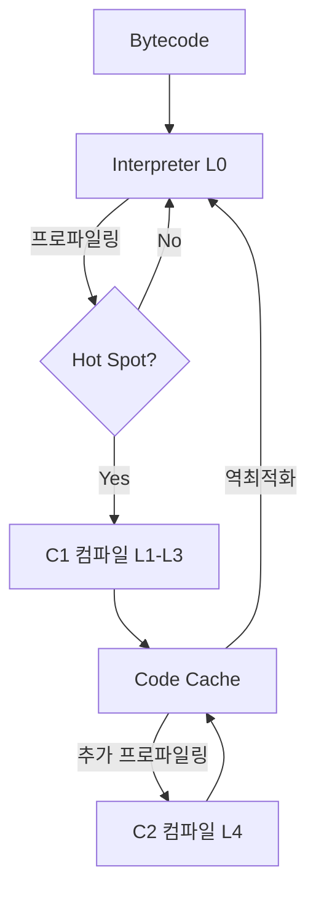

# JIT 컴파일러

JIT(Just-In-Time) 컴파일러는 프로그램 실행 도중에 바이트코드를 해당 플랫폼의 네이티브 기계어로 번역하여 캐시하는 컴파일러다.

- 핵심 원리: 자주 실행되는 코드(Hot Spot)만 골라 한 번 컴파일하고, 결과를 Code Cache에 저장 → 이후 호출에서는 캐시된 네이티브 코드를 직접 실행
- 매 호출마다 다시 컴파일하지 않음 — 한 번 컴파일된 메서드는 역최적화(Deoptimization)되지 않는 한 계속 재사용
- 인터프리터 + JIT을 함께 쓰는 Mixed Mode가 기본 동작

## 매번 컴파일 X

JIT라는 이름이 "Just-In-Time(필요한 그 시점)"이라는 뜻이라 매 호출마다 컴파일이 일어난다고 오해할 수 있지만 실제 동작은 정반대다.

- 컴파일은 호출 누적 횟수가 임계치를 넘은 메서드에 대해 한 번만 수행
- 컴파일 결과는 Code Cache라는 JVM 내부 메모리 영역에 저장
- 다음 호출부터는 인터프리트도, 재컴파일도 없이 캐시된 네이티브 코드를 직접 실행
- 한 번도 핫스팟이 되지 않은 코드는 끝까지 인터프리트로만 실행됨

## Hot Spot 감지 메커니즘

JVM은 모든 코드를 컴파일하지 않으며, 카운터로 호출 빈도를 추적해 임계치를 넘긴 코드만 컴파일 큐에 등록한다.

- Invocation Counter: 메서드가 호출된 누적 횟수
- Backedge Counter: 루프 끝에서 시작점으로 돌아가는 분기 횟수 (긴 루프 감지용)
- 두 카운터의 합이 JVM이 설정한 임계치(Threshold)를 초과하면 컴파일 대상

### On-Stack Replacement (OSR)

메서드 호출 횟수는 적지만 그 안의 루프가 매우 길게 도는 경우, 메서드가 끝날 때까지 기다리지 않고 실행 중간에 네이티브 코드로 갈아끼우는 기법이다.

```java
public void process() {
    // 메서드 자체는 한 번만 호출되지만 루프는 1억 번 돈다
    for (int i = 0; i < 100_000_000; i++) {
        compute(i);
    }
}
// → 루프 실행 도중 컴파일이 끝나면 그 시점에 네이티브 코드로 즉시 교체
```

## Tiered Compilation (계층적 컴파일)

빠른 시작과 최종 성능을 모두 잡기 위해, 현대 JVM은 5단계 계층 컴파일을 사용한다.

|   레벨    |          컴파일러          |                 특징                 |
|:-------:|:----------------------:|:----------------------------------:|
| Level 0 |      Interpreter       |      프로파일링 데이터를 수집하며 바이트코드 실행      |
| Level 1 |      C1 (Simple)       |    최적화·프로파일링 없이 가장 단순하게 C1로 컴파일    |
| Level 2 |  C1 (Limited Profile)  |         낮은 수준의 카운터 정보만 수집          |
| Level 3 |   C1 (Full Profile)    |   분기 예측·타입 정보 수집 (이후 C2 최적화의 입력)   |
| Level 4 | C2 (Full Optimization) | 수집된 모든 데이터로 고도의 최적화 적용한 네이티브 코드 생성 |

- C1 (Client Compiler): 컴파일은 빠르고 최적화는 가벼움 → 초기 응답 속도 확보
- C2 (Server Compiler): 컴파일은 느리지만 최적화 강도는 최고 → 장기 실행 시 최고 성능



## Code Cache

JIT가 컴파일한 네이티브 코드는 JVM 내부의 Code Cache라는 전용 메모리 영역에 저장된다.

- 위치: 힙·메타스페이스와 분리된 별도 네이티브 메모리 (실행 권한이 부여된 영역)
- 기본 최대 크기: Tiered Compilation 활성 시 약 240MB, 비활성 시 48MB (`-XX:ReservedCodeCacheSize`로 조정, 초기 크기는 `-XX:InitialCodeCacheSize`로 별도 지정)
- 한도 초과 시: 새 컴파일이 중단되고 모든 코드가 인터프리터로만 실행 → `CodeCache is full. Compiler has been disabled.` 경고 출력
- 캐시 관리: Sweeper가 호출되지 않는 컴파일 결과를 회수해 공간을 확보하지만, Deoptimization으로 무효화된 `non-entrant` 코드가 누적되면 단편화로 가용 용량이 줄어듦

## Deoptimization (역최적화)

JIT는 런타임에 관찰한 패턴이 앞으로도 유지된다는 가정을 깔고 공격적으로 최적화하는데, 그 가정이 깨지면 컴파일된 네이티브 코드를 폐기하고 인터프리터로 되돌아가는 일이 발생한다.

- 트리거 예시
    - 인라인 캐싱한 가상 메서드의 실제 구현체가 바뀜 (지금까지 한 종류만 호출됐는데 새로운 타입의 객체가 들어옴)
    - 한 번도 발생하지 않으리라 가정한 분기·예외가 실제로 발생
    - 새 서브클래스가 로딩되어 "이 메서드는 단일 구현체만 가진다"는 가정이 무너짐
- 동작: 해당 메서드의 실행 흐름이 컴파일된 네이티브 코드 → 인터프리터로 되돌아가고, 카운터가 다시 쌓이면 재컴파일
- 비용: 자주 일어나면 Code Cache의 `Not-Entrant` 코드가 누적되어 성능 저하
- 일반 애플리케이션에서는 거의 보이지 않으며, 다형성이 극단적으로 높은 코드에서 종종 관찰

## 주요 최적화 기법

JIT는 단순히 바이트코드를 기계어로 1:1 번역하는 것이 아니라, 런타임 프로파일을 기반으로 "지금까지 관찰된 패턴이 앞으로도 유지된다"는 추측(Speculative Optimization)을 깔고 정적 컴파일러가 할 수 없는 공격적 최적화를 수행한다.

- 정적 컴파일러는 모든 입력·실행 경로에 안전한 코드를 생성해야 함 → 가장 일반적인 형태로만 최적화 가능
- JIT는 실제 관찰된 분기·타입·호출 대상을 가정으로 잡고 가지치기 → 예측이 빗나가면 Deoptimization으로 안전하게 인터프리터로 되돌림
- 즉 "런타임 정보 + 빠른 회복 메커니즘"의 조합이 JIT가 정적 컴파일을 추월할 수 있는 본질

### Method Inlining (메서드 인라이닝)

호출 빈도가 높고 크기가 작은 메서드의 본문을 호출 지점에 직접 삽입한다.

```java
// 최적화 전
public int sum() {
    int r = 0;
    for (int i = 0; i < 1000; i++)
        r = add(r, i);
    return r;
}

private int add(int a, int b) {
    return a + b;
}

// 최적화 후 (개념)
public int sum() {
    int r = 0;
    for (int i = 0; i < 1000; i++)
        r = r + i;
    return r;
}
```

호출 오버헤드 제거 + 인라이닝 후 추가 최적화(상수 폴딩, 루프 변형 등)가 연쇄적으로 가능해진다.

### Escape Analysis (탈출 분석)

객체가 메서드·스레드 경계를 벗어나는지 분석한 후, 벗어나지 않으면 다음 최적화가 가능하다.

- Scalar Replacement: Heap 할당 대신 객체 필드를 지역 변수로 분해해 Stack/레지스터에 배치 → GC 부담 감소
- Lock Elision: 단일 스레드에서만 사용되는 객체임이 확인되면 `synchronized` 자체를 제거

### Loop Optimization (루프 최적화)

- Loop Unrolling: 루프 본문을 여러 번 복제해 분기 횟수 감소
- Lock Coarsening: 루프 안에서 반복되는 락을 루프 바깥의 큰 락 하나로 병합

```java
void main() {
    // 최적화 전
    int sum = 0;
    for (int i = 0; i < 100; i++) {
        sum += data[i];
    }
    // 최적화 후
    int sum = 0;
    for (int i = 0; i < 100; i += 4) {
        sum += data[i];
        sum += data[i + 1];
        sum += data[i + 2];
        sum += data[i + 3];
    }

    // 최적화 전
    for (int i = 0; i < 1000; i++) {
        synchronized (this) { /* ... */ }
    }

    // 최적화 후
    synchronized (this) {
        for (int i = 0; i < 1000; i++) { /* ... */ }
    }


}

```

## JVM Warm-up

Code Cache가 충분히 채워지기 전까지는 핵심 코드도 인터프리트로 실행되어 응답 시간이 정상 대비 수십~수백 배 느릴 수 있다. 이 구간을 사전에 통과시키는 작업이 워밍업이다.

- 배포 직후 첫 요청들이 클래스 로딩·링크·JIT 컴파일 대기를 동시에 부담
- 응답 시간이 정상 대비 수십 - 수백 배 느려질 수 있음
- 점유된 자원(DB 커넥션, 스레드)이 반환되지 않아 후속 요청에 연쇄 지연 발생

### 완화 방법

|             방법              |                      효과                       |
|:---------------------------:|:---------------------------------------------:|
| 워밍업 (`ApplicationRunner` 등) | 트래픽 유입 전에 핵심 경로를 미리 실행해 클래스 로딩·JIT 컴파일을 사전 완료 |
| AOT (GraalVM Native Image)  |        빌드 시점에 모든 링크를 끝내 런타임 비용 자체를 제거         |
