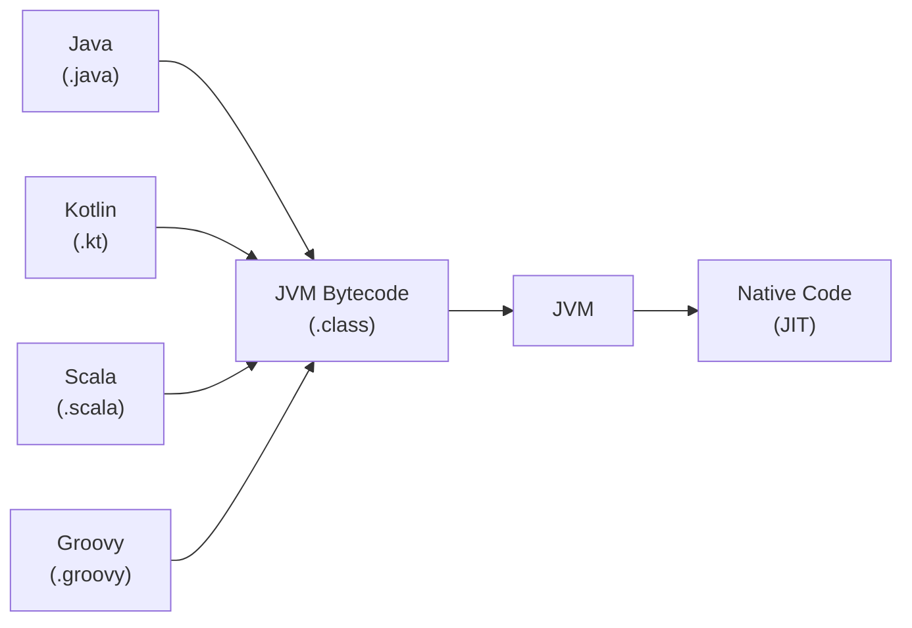

> 자바 외의 언어를 JVM 위에서 실행할 수 있나요? 반대로 JVM 계열 언어를 네이티브로 컴파일하여 사용할 수는 없나요?

# JVM 언어 생태계와 AOT 컴파일

JVM은 자바 언어에 한정 된 가상 머신이 아닌, JVM 명세를 따르는 바이트코드(`.class`)라면 어떤 언어로 작성되었든 실행 가능하다.

- JVM 위에서 실행 가능: Kotlin, Scala, Groovy, Clojure 등 — 자체 컴파일러로 바이트코드를 생성
- 네이티브로 컴파일 가능: GraalVM Native Image로 JVM 언어를 빌드 시점에 미리 컴파일(AOT, Ahead-Of-Time)하여 JVM 없이 실행 가능한 OS 네이티브 실행 파일로 변환

## JVM과 바이트코드

자바 컴파일러(`javac`)는 자바 소스를 바이트코드로 만드는 여러 도구 중 하나일 뿐, JVM은 입력 언어를 모르고 명세를 만족하는 바이트코드를 받아 실행하게 된다.

이들은 모두 결국 동일한 `.class` 형식으로 컴파일되므로, 자바 코드와 같은 클래스패스에 두고 서로 호출하면서, Spring Boot 프로젝트에서 자바·코틀린을 한 모듈에 섞어 쓸 수 있게 된다.

## JVM 언어를 네이티브로 컴파일

전통적으로 자바는 JVM 없이는 실행할 수 없다고 여겨졌지만, GraalVM의 Native Image를 사용하면 빌드 시점에 네이티브 바이너리를 직접 생성할 수 있다.

### GraalVM Native Image

GraalVM은 빌드 타임에 애플리케이션의 모든 코드 경로를 정적 분석하여, 실제로 도달 가능한 코드만 추출해 OS 네이티브 실행 파일로 변환한다.

- 빌드 산출물: 단일 OS 네이티브 바이너리 (JVM 없이 실행)
- 기동 시간: 밀리초 단위 (JVM 클래스 로딩·JIT 예열 생략)
- 메모리 점유: 매우 낮음 (JVM 엔진과 컴파일러 자체가 빠짐)
- 제약: 빌드 시점에 모든 도달 가능 코드가 결정되어야 함 → 리플렉션, 동적 프록시, JNI는 별도 메타데이터 설정 파일 필요
- 플랫폼 종속: 빌드한 OS·CPU 아키텍처에서만 실행 가능 (자바 본래의 장점 포기)
- 빌드 비용: 정적 분석 + 네이티브 컴파일을 모두 수행하므로 빌드 시간이 매우 김 (작은 앱도 수십 초, Spring Boot 기준 수 분)

### AOT 친화 프레임워크

전통적인 자바 프레임워크는 런타임 리플렉션과 동적 프록시에 강하게 의존하여 Native Image와 궁합이 좋지 않았으나, 이를 해결하기 위해 빌드 시점에 메타데이터를 생성하는 방향으로 설계된 프레임워크가 등장했다.

|              프레임워크              |                        특징                         |
|:-------------------------------:|:-------------------------------------------------:|
| Spring Boot 3.x + Spring Native | 기존 Spring 자산 재활용, 빌드 시점 reflection metadata 자동 생성 |
|             Quarkus             |    GraalVM 네이티브 빌드를 1차 타겟으로 설계, 컴파일 타임 의존성 처리     |
|            Micronaut            |             AOT 컴파일 친화, 컴파일 시점 DI/AOP             |

## JIT vs AOT 비교

같은 자바 소스라도 실행 방식에 따라 성능 특성이 극적으로 달라진다.

|     구분      |     JIT (표준 JVM)      |     AOT (Native Image)     |
|:-----------:|:---------------------:|:--------------------------:|
|   컴파일 시점    |          런타임          |           빌드 시점            |
|    기동 속도    |      느림 (예열 필요)       |       매우 빠름 (즉시 실행)        |
|    최고 성능    | 매우 높음 (실행 데이터 기반 최적화) |     높음 (정적 분석 기반 최적화)      |
|   메모리 사용    |  높음 (JVM + 컴파일러 포함)   |           매우 낮음            |
| 리플렉션·동적 프록시 |        자유롭게 사용        |        메타데이터 설정 필요         |
|   플랫폼 독립성   | O (`.class` 어디서든 실행)  |     X (빌드한 OS/CPU에 종속)     |
|   적합한 환경    | 장기 실행 서버, 복잡한 비즈니스 로직 | 서버리스(Lambda), 마이크로서비스, CLI |

- AOT 방식: 빌드 시점에 특정 OS용 바이너리를 직접 생성하므로 기동 속도가 즉각적이며 메모리 점유율이 낮음
- JIT 방식: 프로그램이 동작하는 환경과 실제 데이터 흐름을 분석하므로, 특정 조건에서 AOT보다 더 높은 수준의 성능 최적화 가능
