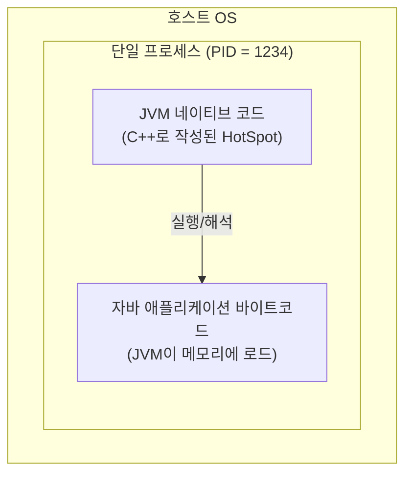

> JVM과 그 내부에서 실행되는 프로그램의 관계를 부모-자식 프로세스 관점에서 어떻게 바라볼 수 있을까요?

# JVM과 호스트 OS의 프로세스 관계

자바 개발자가 "JVM 위에서 자바 프로그램이 실행된다"라고 말할 때 두 실행 주체가 부모-자식처럼 쌓여 있는 모습이 떠오르지만, OS가 실제로 보는 것은 `java`라는 단 하나의 프로세스다.

- 표면적 모델: JVM(부모) → 자바 프로그램(자식)으로 보이는 컨테이너 비유
- 실제 OS 모델: `java` 프로세스 1개 안에서 JVM이 자바 바이트코드를 해석·실행

논리적 관점으로는 강력한 제어권을 가진 관리자(JVM)-수행자(프로그램) 관계로 해석할 수 있다.

## 부모-자식 프로세스 관계와의 논리적 공통점

물리적인 OS 계층에서는 JVM이 단일 프로세스이지만, 동작 원리를 뜯어보면 OS의 부모-자식 프로세스 모델과 닮은 점이 많다.

|         구분         |         OS 부모-자식 프로세스          |             JVM - 자바 프로그램             |
|:------------------:|:------------------------------:|:-------------------------------------:|
|  자원 할당 (Resource)  |   부모가 가진 메모리·자원의 일부를 자식에게 할당   |  JVM이 OS로부터 받은 Heap/Stack을 프로그램에 배분   |
|    환경 전파 (Env)     |       부모의 환경 변수를 자식이 상속        | 실행 시 설정한 시스템 프로퍼티(`-D`)를 프로그램이 그대로 사용 |
| 생명 주기 (Lifecycle)  | 부모가 종료되면 자식도 영향을 받음 (종료 혹은 고아) |       JVM이 종료되면 내부 프로그램은 즉시 소멸        |
| 상태 감시 (Monitoring) |  부모가 자식의 종료 코드(Exit Code)를 확인  |  프로그램 실행 중 발생한 예외(Exception)를 포착·처리   |
|   제어 신호 (Signal)   |    부모가 자식에게 시그널을 보내 실행을 제어     |  JVM이 프로그램 스레드를 스케줄링하고 필요 시 STW로 중단   |

두 모델 모두 상위 존재(부모 / JVM)가 하위 존재(자식 / 프로그램)에게 독립적이고 안전한 실행 환경을 보장한다는 점이 핵심이다.

- OS는 부모를 통해 자식에게 독립된 가상 메모리 공간을 제공하여 다른 프로세스를 침범하지 못하게 보호
- JVM은 자바 프로그램이 OS의 로우 레벨 자원을 직접 건드리지 못하도록 격리된 논리적 보호 구역(Sandbox)을 제공

결과적으로 메모리·환경 설정·보안 검사와 같은 일을 상위 존재가 대신 처리하고, 하위 존재는 주어진 로직 수행에만 집중하면 되는 위임형 관리 구조를 갖는다.

## 자바 프로그램 실행 시 실제로 일어나는 일

셸에서 `java` 명령으로 자바 프로그램을 실행했을 때 시간 순서대로 따라가면 한 프로세스에 있다는 것을 알 수 있다.

1. 셸이 `fork`/`exec` 시스템 콜로 `java` 네이티브 실행 파일을 새 프로세스로 띄움
2. 생성된 프로세스 안에서 JVM 본체(HotSpot 등) 부트스트랩
3. 클래스 로더가 애플리케이션 `.class` 파일(또는 jar 안의 바이트코드)을 같은 프로세스 메모리로 로드
4. JVM 인터프리터/JIT가 그 바이트코드를 해석·실행



3번에서 새 프로세스가 추가로 만들어지지 않으며, 하나의 프로세스로 잡히게 된다.

- `.class` 파일은 디스크 바이트의 묶음이고, 실행 주체는 이미 떠 있는 `java` 프로세스
- `ps`나 `htop`에서 잡히는 것도 `java` 한 개의 프로세스
- 자바 코드 안에서 별도 프로세스를 만들려면 `Runtime.exec()`나 `ProcessBuilder`로 명시적으로 자식 프로세스를 fork해야 함

## `Runtime.exec()`로 진짜 자식 프로세스를 만들 때

JVM 안에서 외부 명령을 실행할 때 명시적으로 자식 프로세스를 만들면, 그 시점에서 부모-자식 프로세스 관계가 성립한다.

```java
void main() {
    Process p = new ProcessBuilder("ls", "-l").start();
    p.waitFor();
}
```

- 내부적으로 OS의 `fork`/`exec` 등 프로세스 관련 명령어 호출
- 자식 프로세스는 별도의 PID, 별도의 주소 공간을 가짐
- 자바 코드와는 표준 입출력 스트림(stdin/stdout/stderr)으로만 통신
- 부모 JVM이 죽어도 자식 프로세스는 살아남을 수 있음
