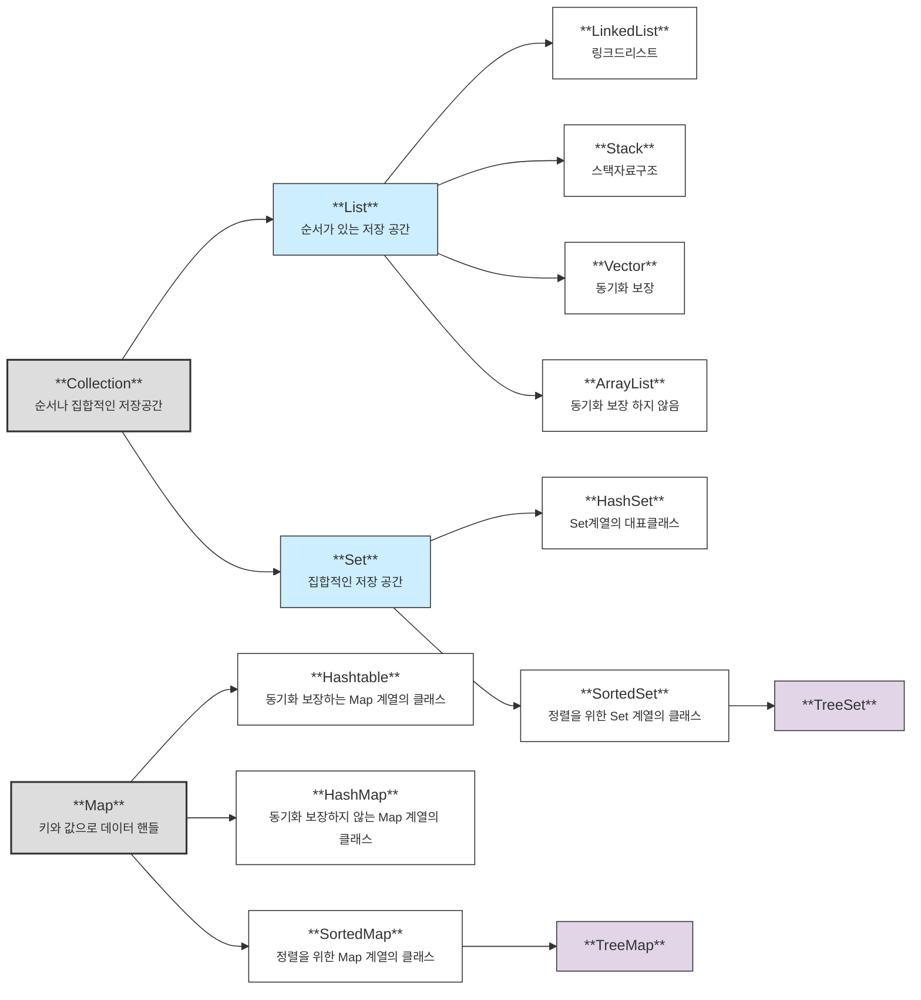

## 자바 컬렉션 프레임워크(Collection Framework)의 주요 인터페이스(List, Set, Map)와 그 특징을 비교해주세요.

> List는 순서가 있는 데이터를 관리하고, 중복이 가능합니다.
>
> Set의 경우 중복을 허용하지 않고 순서는 유지되지 않습니다.
>
> Map의 경우 데이터를 key 와 value 로 관리하며 key 는 중복허용되지 않지만 value 는 중복이 가능합니다.

자바의 컬렉션 프레임워크는 데이터의 집합이며
이러한 데이터, 자료구조인 컬렉션과 이를 구현하는 클래스를 정의하는 인터페이스를 제공한다.

컬렉션은 기본적으로 **객체**만 가능하다.
따라서 오토 박싱과 오토 언박싱을 이요해 기본형으로 바꿀 수 있다.


(아래가 프레임워크 상속 구조)



Map은 Collection 인터페이스를 상속 받고 있지 않지만 Collection으로 분류된다.

### List

List 는 **순서**가 있는 **데이터의 집합**으로 **데이터의 중복**을 허용한다.

LinkedList, Vector, ArrayList 가 존재한다.

- LinkedList : 양방향 포인터 구조로 데이터 삽입,삭제가 빈번하면 해당 위치 정보만 수정하면 되기에 유용하다. (스택, 큐, 양방향 큐 등을 만들기 위한 용도로 쓰인다.)

- Vector: 과거에 대용량 처리를 위해 썼지만, 내부에서 자동으로 동기화 처리가 일어나서 비교적 성능이 좋지 않고 무거워서 잘 안 쓰임

- ArrayList: 단방향 포인터 구조로 각 데이터에 대한 인덱스를 가지고 있어서 조회 기능에 성능이 뛰어나다.

### Set

Set 은 **순서를 유지하지 않는** 데이터의 집합으로 **데이터의 중복을 허용하지 않는다.**

HashSet, TreeSet 가 존재한다.

- HashSet: 가장 빠른 임의 접근 속도를 가지며 순서를 예측할 수 없다.

- TreeSet: 정렬 방법을 지정할 수 있다.


### Map

Map 은 **Key와 Value**의 쌍으로 이루어진 데이터의 집합이고, **순서는 유지되지 않으며** **키의 중복을 허용하지 않**으나 **값의 중복은 허용**한다.

Hashtable, HashMap, TreeMap 이 존재한다.

- HashTable: Hashmap 보다는 느리다만 동기화가 가능하다. 단, null 은 불가능하다.

- HashMap: 중복과 순서를 허용하지 않고 null 이 돌 수 있다.

- TreeMap: 정렬된 순서대로 키와 값을 저장해 검색이 빠르다.


### Collection 인터페이스의 주요 메서드 보기 👁️

```

boolean add(E e)

boolean addAll(Collection<? Extends E> c)

boolean contains(Object o)

boolean containsAll(Collection<?> c)

boolean remove(Object o)

boolean removeAll(Collection<?> c)

// 현재 컬렉션에서 컬렉션 c 와 일치하는 데이터만 남기고 모두 삭제
boolean retainAll(Collection<?> c)

void clear();

int size();

boolean isEmpty();

// 현재 컬렉션의 모든 요소에 대한 iterator 반환
Iterator<E> iterator();

// 현재 컬렉션에 저장된 데이터를 Object 배열로 반환
Object[] toArray();

// 현재 컬렉션 저장된 데이터를 배열에 담고 배열 반환
<T> T[] toArray(T[] a);
```