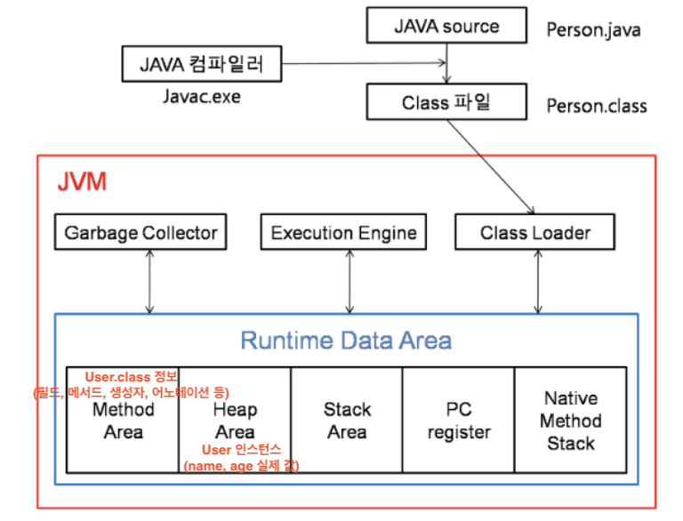

### Q. 리플렉션(Reflection)이 무엇이며, 실제 프레임워크에서의 활용 사례에 대해 설명해주세요.

Reflection은 런타임에 JVM의 메타데이터를 조회하여 클래스의 필드나 메서드에 동적으로 접근하고 실행할 수 있는 기능입니다. 이를 통해 컴파일 시점이 아닌 실행 시점에 객체의 구조를 분석하고 조작할 수 있습니다.

대표적으로 Spring 프레임워크에서는 `@Autowired`가 붙은 필드를 Reflection으로 탐색해 Bean을 주입하는 방식으로 의존성 주입을 구현합니다.

컴파일 시점에 클래스 구조를 알지 못해도 동작할 수 있다는 장점이 있지만, 성능 오버헤드와 타입 안정성 문제가 있어 주로 프레임워크 내부에서 사용됩니다.

</br>
</br>

### 💡 Reflection : 뭐가 반사된걸까?


- **런타임**에 클래스와 인터페이스 등을 검사하고 조작할 수 있는 기능
- ex) 클래스 이름, 메서드, 필드, 생성자 등에 대한 정보를 프로그램 실행 중에 알아내고, 이를 통해 객체를 생성하거나 메서드 호출 가능

</br>
</br>

**동작 원리**



JVM 구조, 동작 흐름

- 1단계 : 클래스 로딩
    
    ```
    .java → .class → ClassLoader → JVM
    ```
    
    - ClassLoader가 클래스를 JVM에 올림
    - 이때 클래스 정보가 Method Area에 저장됨
- 2단계 : 메타데이터 자장 (Method Area)
    - 클래스 이름, 메서드 정보, 필드 정보, 어노테이션 정보 등이 저장된
- 3단계 : Reflection이 접근
    
    ```java
    Class<?> clazz = User.class;    // JVM이 제공하는 Class 객체 : Class<?>
    Method[] methods = clazz.getDeclaredMethods();
    ```
    
    - Method Area에 직접 접근이 아니라, JVM이 제공하는 **class 객체를 통해 간접적으로 접근**

</br>

**→ 그림에서 반사된 사물은 “JVM 메모리에 저장된 클래스 메타데이터”를 의미한다.**

**Reflection은 거울에 반사된 메타 데이터를 보고 실제 사물인 객체를 조작하는 도구이다.**

</br>

**코드 예시**

User 클래스가 다음과 같이 정의되어 있다면

```java
public class User {
    private String name;
    private int age;

    public User() {}

    public void hello() {
        System.out.println("Hello!");
    }

    private void secret() {
        System.out.println("Secret method");
    }
}
```

1. 실행 중에 클래스 정보 가져오기

```java
Class<?> clazz = Class.forName("User");

System.out.println(clazz.getName());
```

2. 생성자 호출 (동적 객체 생성)

new User() 없이 생성 가능

```java
Class<?> clazz = Class.forName("User");

Object obj = clazz.getDeclaredConstructor().newInstance();
System.out.println(obj);
```

3. 메서드 호출 (동적 실행)

```java
Class<?> clazz = Class.forName("User");
Object obj = clazz.getDeclaredConstructor().newInstance();

Method method = clazz.getMethod("hello");
method.invoke(obj);

// 출력 결과 : Hello!
```

4. private 메서드 접근

```java
Method secretMethod = clazz.getDeclaredMethod("secret");
secretMethod.setAccessible(true); // private 접근 허용

secretMethod.invoke(obj);

// 출력 : Secret method
```

5. 필드 접근 (private 포함)

```java
Field nameField = clazz.getDeclaredField("name");
nameField.setAccessible(true);

nameField.set(obj, "namename");

System.out.println(nameField.get(obj));
```

<details>
<summary>참고 invoke 함수</summary>
    
    
    invoke 는 Reflection에서 메서드를 대신 실행해주는 함수이다.
    
    ```java
    Method method = clazz.getMethod("pay");
    
    method.invoke(userService);
    ```
    
    이 코드와
    
    ```java
    userService.pay();
    ```
    
    이 코드의 동작은 같다.

</details>

</br>

**프레임워크 활용 사례**

- hibernate
    - ORM 프레임워크인 하이버네이트는 리플렉션을 사용해 객체와 데이터베이스 테이블 간의 매핑을 동적으로 처리함
- JUnit 테스트 프레임워크
    - 테스트 케이스를 동적으로 로드하고 실행
    - @Test 어노테이션이 달린 메서드를 찾아 테스트 수행
- SpringDI
    - ~~아래 자세한 예시~~

</br>

**Spring DI (@Autowired)**

```java
@Service
public class UserService {
}
```

```java
@RestController
public class UserController {

    @Autowired
    private UserService userService;
}
```

</br>

Spring 내부에서 하는 일

1. 클래스 스캔 (Bean 후보 찾기)

```java
Class<?> clazz = Class.forName("UserController");
```

- 실제로는 Spring이 관리해야 할 “관리 대상 클래스 목록”이 있다고 함
2. 필드 분석 (DI 탐색 대상)

```java
for (Field field : clazz.getDeclaredFields()) {
    if (field.isAnnotationPresent(Autowired.class)) {  // Autowired 어노테이션 붙은 필드
```

- 어떤 필드가 의존성인지 판단 ⇒ Autowired 어노테이션이 있으면 Spring이 자동으로 채워줘야 하는 의존성인 것 판단 가능 (오직 어노테이션 기반으로 판단)

```java
Class<?> type = field.getType();    // 필드 타입 추출 (type = UserService.class)
Object bean = applicationContext.getBean(type);
```

- 어떤 객체를 주입해야 하는지 (UserService를 주입해야 함)
    - IoC 컨테이너 안에서 UserService 타입의 Bean 찾음
    - {Key: Class 타입, Value: 실제 객체} Spring은 내부적으로 이런 Map을 가지고 있음
    - ex) UserService.class → UserService@0x1234
3. 의존성 주입 (Reflection 으로 필드 변경)
- Java는 원래 private 필드 접근 불가능이지만 Reflection으로 강제 접근 (jvm의 접근 제어 우회)

```java
field.setAccessible(true);
field.set(controllerInstance, bean);
```

⇒  Reflection을 사용하면 개발자가 UserService를 직접 주입하는 코드를 작성하지 않아도, 시스템이 클래스 구조와 어노테이션 정보를 런타임에 읽어 의존성을 자동으로 주입할 수 있다.

특히 UserController에 어떤 의존성이 몇 개 존재하는지 미리 알 수 없는 상황에서도, Reflection을 통해 일관된 방식으로 처리할 수 있다.

</br>

**Annotation과의 관계**

Annotation은 “의미를 선언하는 메타 데이터”이다. (코드에 의미, 의도, 설정 붙임, 실행 로직 X)

Reflection은 “그 메타데이터를 읽어 동작으로 바꾸는 실행 메커니즘”이다.

</br>

**단점**

1. 성능 오버헤드
- 메서드 호출이 직접 호출이 아닌 간접 호출(invoke)로 이루어짐
- JVM의 인라이닝, JIT 최적화 등을 충분히 활용하지 못함
- 접근 체크, 타입 검사 등 추가 작업이 발생
- ⇒ 일반 코드보다 느림
1. 컴파일 타임 타입 안정성 부족
- 문자열 기반으로 필드/메서드 접근
- 컴파일 시점에 오류를 잡지 못함
- ⇒ 오류가 런타임에 발생
1. 캡슐화 위반 가능성
- `setAccessible(true)`로 private 접근 가능
- 객체의 내부 구현을 강제로 변경 가능
- ⇒ 객체 지향 원칙, 캡슐화 훼손
1. 코드 가독성 및 유지보수성 저하
- 일반 코드보다 이해하기 어려움
1. 디버깅 어려움
- 실행 흐름이 명확하지 않음 (동적 호출)
- 스택 트레이스 추적이 어려움

</br>

**참고 자료**

[[10분 테코톡] 헙크의 자바 Reflection](https://www.youtube.com/watch?v=RZB7_6sAtC4)

[[Java] 자바 리플렉션(reflection)이란?](https://curiousjinan.tistory.com/entry/java-reflection-explain)

[[JAVA] Reflection / 개념 / 예제 / 단점 / DI 프레임워크 구현](https://tlatmsrud.tistory.com/112)