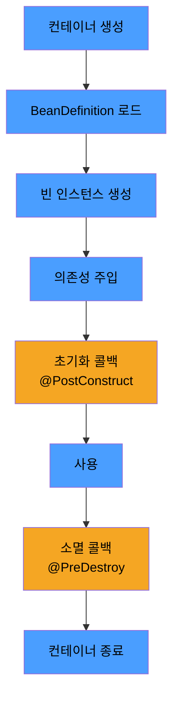

# Spring Bean과 생명주기

> - Spring Bean: 컨테이너가 BeanDefinition 메타데이터를 기반으로 생성·조립·관리하는 객체
> - 일반 자바 객체와는 다르게 컨테이너가 생성·DI·초기화·소멸을 일괄 처리
> - 생명주기: 컨테이너 기동 → 인스턴스 생성 → 의존성 주입 → 초기화 콜백 → 사용 → 소멸 콜백
> - 초기화·소멸 훅은 `@PostConstruct`/`@PreDestroy`, `InitializingBean`/`DisposableBean`, `@Bean(initMethod, destroyMethod)` 존재

Spring Bean은 컨테이너가 직접 인스턴스화하고, 의존성을 주입하고, 초기화·소멸 콜백을 호출하며, 스코프에 따라 수명을 관리하는 객체이다.

## BeanDefinition

빈은 곧바로 객체로 만들어지지 않고, 먼저 메타데이터(BeanDefinition) 로 등록된 뒤 컨테이너가 그 정의를 읽어 객체를 만든다.

|         항목         |              의미              |
|:------------------:|:----------------------------:|
|     beanClass      |       빈으로 등록할 Java 클래스       |
|         id         |  컨테이너 내 식별자(기본: 클래스명 소문자화)   |
|       scope        |   인스턴스 생존 범위(기본 singleton)   |
|  constructorArgs   |          생성자 주입 인자값          |
|     properties     |      세터 주입 인자값(setter)       |
| init/destroyMethod |        초기화·소멸 콜백 메서드명        |
|      lazyInit      | 지연 초기화 여부(기본 false, 기동 시 생성) |
|      primary       |     동일 타입 다중 후보 중 우선 선택      |

- 같은 클래스라도 BeanDefinition이 다르면 다른 빈
- XML, `@Bean`, 컴포넌트 스캔 모두 최종적으로 BeanDefinition으로 등록

## 등록 방법

|     방식      |          어노테이션·표기          |      사용 시점       |
|:-----------:|:--------------------------:|:----------------:|
|   컴포넌트 스캔   | `@Component`, `@Service` 등 |  직접 작성하는 클래스 다수  |
| Java 설정 클래스 | `@Configuration` + `@Bean` | 외부 라이브러리, 조건부 생성 |
|   XML 설정    |       `<bean>` (레거시)       |   레거시 코드 유지·이관   |

## 생명주기

스프링 빈은 컨테이너 기동부터 종료까지 다음 단계를 거친다.



1. 컨테이너 생성 — `ApplicationContext` 초기화
2. BeanDefinition 로드 — 컴포넌트 스캔·`@Configuration` 분석
3. 인스턴스 생성 — 생성자 호출(생성자 주입은 이 단계에서 의존성 동시 주입)
4. 의존성 주입 — 세터/필드 주입은 여기서 수행
5. 초기화 콜백 — `@PostConstruct`, `InitializingBean#afterPropertiesSet`, `@Bean(initMethod)`
6. 사용 — 애플리케이션 런타임
7. 소멸 콜백 — `@PreDestroy`, `DisposableBean#destroy`, `@Bean(destroyMethod)`
8. 컨테이너 종료

생성자 주입은 3,4단계가 한 번에 일어나고, 세터·필드 주입은 3단계에서 객체만 만들어지고 4단계에서 주입이 일어난다.

## 초기화·소멸 콜백

### 1. `@PostConstruct` / `@PreDestroy`

```java

@Component
class CacheWarmer {

    @PostConstruct
    void warm() { ...}  // DI 완료 후 자동 호출

    @PreDestroy
    void flush() { ...} // 컨테이너 종료 직전 자동 호출
}
```

- 최신 Spring에서 가장 권장되는 방식
- 클래스에 어노테이션만 추가하면 별도 설정 없이 동작
    - `CommonAnnotationBeanPostProcessor`가 처리하므로 등록 방식(컴포넌트 스캔·`@Bean`·XML)과 무관하게 컨테이너가 만든 모든 빈에 적용
    - 빈의 초기화·소멸 로직이 클래스 자체에 응집되어, 동작을 파악할 때 다른 파일을 뒤질 필요가 없음
- 단점: 외부 라이브러리 클래스에는 어노테이션을 붙일 수 없음
    - 어노테이션은 소스 코드에 직접 작성해야 적용되는데, 외부 라이브러리는 빌드된 `.jar`로 들어오므로 소스 수정이 불가
    - `HikariDataSource`, `RedisClient`, `HttpClient` 같은 외부 클래스의 초기화·종료 훅이 필요한 경우 이 방식으로는 처리 불가
    - 이런 경우엔 3번 방식(`@Bean(initMethod, destroyMethod)`)으로 우회

### 2. 인터페이스 구현 (`InitializingBean`, `DisposableBean`)

```java
class CacheWarmer implements InitializingBean, DisposableBean {

    @Override
    public void afterPropertiesSet() { ...}

    @Override
    public void destroy() { ...}
}
```

- 스프링 전용 인터페이스에 의존
- 메서드명 변경 불가
- 외부 라이브러리에 적용 불가
- 사실상 거의 사용하지 않음 (레거시 코드 유지보수용)

### 3. `@Bean(initMethod, destroyMethod)`

```java

@Configuration
class AppConfig {

    @Bean(initMethod = "init", destroyMethod = "close")
    NetworkClient client() {
        return new NetworkClient();
    }
}
```

- 외부 라이브러리의 메서드도 지정 가능
    - `@PostConstruct`·`InitializingBean`은 클래스 소스 코드에 직접 코드를 추가해야 동작하므로, `.jar`로 들어오는 외부 라이브러리에는 적용 불가
    - `@Bean`은 외부에서 메서드명을 문자열로 알려주는 방식이라 클래스 수정 없이 적용 가능 (Spring이 리플렉션으로 호출)
    - 예: `HikariDataSource`, `JedisPool` 같은 라이브러리 클래스에 `destroyMethod = "close"` 지정하면 컨테이너 종료 시 자동으로 자원 해제
- `destroyMethod`를 지정하지 않으면 `close`·`shutdown` 같은 일반적인 종료 메서드를 자동 탐지(추론 기능)
    - 대부분의 자원 관리 라이브러리가 `AutoCloseable`을 구현하므로 편리하지만, 의도치 않은 호출이 일어날 수 있음
    - 추론을 막으려면 `destroyMethod = ""` 명시

### 호출 순서

세 가지 방식을 동시에 적용하면 다음 순서로 호출된다.

1. `@PostConstruct`
2. `InitializingBean#afterPropertiesSet`
3. `@Bean(initMethod)`

소멸 콜백도 같은 순서. 보통은 한 가지 방식만 일관되게 사용하는 것이 권장된다.

## 일반 객체와의 차이

|   항목    |   일반 자바 객체   |            Spring Bean            |
|:-------:|:------------:|:---------------------------------:|
| 인스턴스 생성 | `new` 호출자 책임 |     컨테이너가 BeanDefinition으로 생성     |
| 의존성 주입  |    직접 전달     | `@Autowired` 또는 생성자 시그니처 기반 자동 주입 |
| 초기화 시점  |  생성자 종료 직후   |     DI 완료 후 콜백 단계에서 별도 지정 가능      |
|  소멸 시점  |  GC가 수거할 때   |     컨테이너 종료 시 콜백 → 자원 해제 결정적      |
| AOP 적용  |      불가      |   프록시 통해 `@Transactional` 등 가능    |
|   스코프   |    해당 없음     |   singleton / prototype / web 등   |
