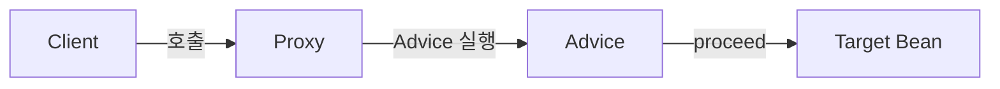
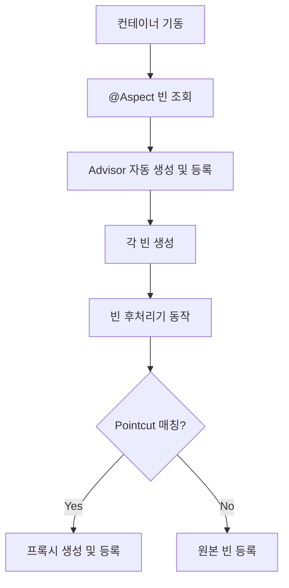

# AOP와 @Aspect 동작 방식

> - AOP: 트랜잭션·로깅·보안 같은 횡단 관심사를 핵심 로직에서 분리해 모듈화하는 패러다임
> - 스프링 AOP는 컴파일/로드타임 위빙이 아닌 런타임 프록시 기반으로 동작
> - `@Aspect`는 빈 후처리기가 어드바이저로 변환해, 포인트컷에 매칭되는 빈을 자동으로 프록시로 감싸는 방식으로 적용
> - 같은 객체 내부 메서드 호출(self-invocation)은 프록시를 거치지 않아 어드바이스가 적용되지 않는 문제 발생 문제 주의

## AOP의 의의

핵심 비즈니스 로직과 무관하지만 여러 곳에 반복되는 부가 기능(횡단 관심사)을 별도 모듈로 분리한다.

- 트랜잭션·로깅·보안·캐시·재시도처럼 메서드마다 중복으로 흩어지던 코드를 어드바이스로 모듈화하여 한 곳에서 관리 가능
- 핵심 로직은 비즈니스 규칙만 표현하고 부가 로직은 한 곳에서 일관되게 관리
- 사용 측은 `@Transactional` 한 줄 선언으로 필요한 기능 적용

## 핵심 용어

|    용어    |                의미                |
|:--------:|:--------------------------------:|
|  Aspect  | 어드바이스 + 포인트컷의 모듈 (`@Aspect` 클래스) |
|  Advice  |           부가 기능 로직 자체            |
| Pointcut |  어드바이스를 적용할 지점 선별 (AspectJ 표현식)  |
|  Target  |        어드바이스가 적용되는 대상 객체         |
| Advisor  |  Advice + Pointcut 한 쌍 (스프링 전용)  |

스프링 AOP는 메서드 실행 시점만 지원한다(필드 접근·생성자 호출 등은 AspectJ 영역).

## 프록시 기반 동작

스프링 AOP는 런타임에 Target을 감싸는 프록시 객체를 만들어 메서드 호출을 가로채는 방식으로 동작한다.



- 클라이언트는 Target이 아닌 Proxy를 주입받음
- Proxy가 메서드 호출을 가로채 Advice 실행 → `proceed()`로 실제 Target 호출

### JDK 동적 프록시 vs CGLIB

|        기술        |      기반      |        조건        |                한계                 |
|:----------------:|:------------:|:----------------:|:---------------------------------:|
|    JDK 동적 프록시    |    인터페이스     | Target이 인터페이스 구현 |          인터페이스 없으면 사용 불가          |
| CGLIB(2.0부터 기본값) | 상속(바이트코드 조작) |      구체 클래스      | `final` 클래스·메서드 프록시 불가, 기본 생성자 필요 |

## @Aspect 동작 방식

`@Aspect`로 작성한 클래스는 컨테이너 기동 시 어드바이저로 변환되고, 빈 후처리기가 등록되는 모든 빈을 검사해 매칭되는 경우 프록시로 감싼다.

```java

@Aspect
@Component
class LoggingAspect {

    @Around("execution(* com.example.service..*(..))")
    Object log(ProceedingJoinPoint pjp) throws Throwable {
        log.info("start: {}", pjp.getSignature());
        try {
            return pjp.proceed();  // Target 메서드 호출
        } finally {
            log.info("end: {}", pjp.getSignature());
        }
    }
}
```

### 전체 흐름



1. `@Aspect` 클래스를 스캔하여 Advisor(Advice + Pointcut)로 변환
2. 일반 빈이 생성될 때마다 `BeanPostProcessor`가 모든 Advisor의 Pointcut과 매칭 시도
3. 매칭되면 ProxyFactory를 통해 프록시 객체 생성, 원본 대신 프록시를 컨테이너에 등록

결과적으로 클라이언트는 프록시를 주입받게 되고, 메서드 호출 시 Advice가 자동으로 실행된다.

## Self-Invocation 문제

같은 클래스 내부에서 다른 메서드를 호출하면 프록시를 거치지 않고 `this` 참조로 원본 객체를 호출하기 때문에 어드바이스가 적용되지 않는다.

```java

@Service
class MyService {

    public void outer() {
        this.inner();  // 프록시가 아닌 원본의 inner() 직접 호출 → @Transactional 무시됨
    }

    @Transactional
    public void inner() { ...}
}
```

해결 방법은 다음 셋 중 하나를 선택할 수 있지만, 보통 구조 분리가 가장 권장된다.

|    해결     |                       방식                        |
|:---------:|:-----------------------------------------------:|
| 자기 자신 주입  |         프록시 객체인 자기 자신을 `@Autowired`로 주입         |
|   지연 조회   | `ObjectProvider` / `ApplicationContext`로 lookup |
| **구조 분리** |          내부 호출 대상을 별도 빈으로 분리 (스프링 권장)           |
