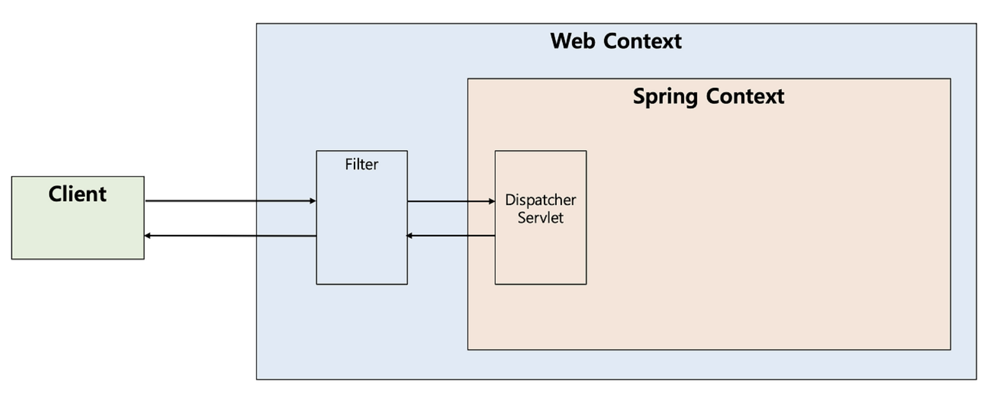
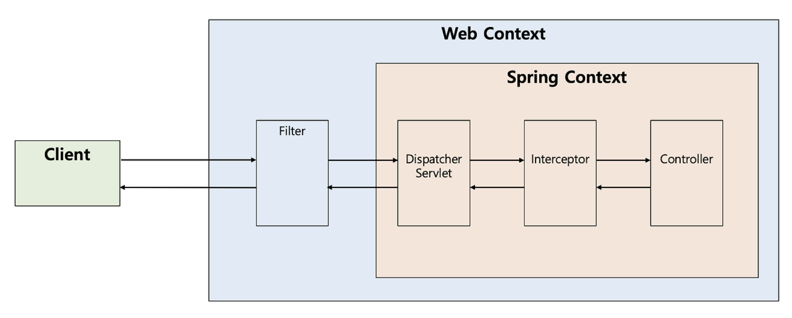
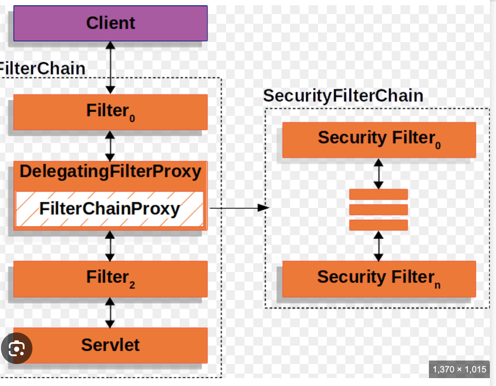

## Q. Filter와 Interceptor는 어떤 차이가 있고 언제 사용하나요?

Filter는 Servlet 영역에서 동작하며 DispatcherServlet 앞단에서 요청과 응답을 공통 처리합니다. 그래서 CORS 처리, XSS 방어, 인증/인가처럼 웹 애플리케이션 전역 수준의 작업에 주로 사용합니다.

반면 Interceptor는 Spring MVC 영역에서 동작하며, 어떤 Controller를 호출할지 결정된 이후 실행됩니다. 따라서 Handler 정보와 Spring Bean에 접근할 수 있어 로그인 체크, 권한 검사, API 로깅처럼 Controller 중심의 공통 로직 처리에 사용합니다.

</br>

---

Filter와 Interceptor는 모두 공통 로직을 처리하기 위한 기술이지만, 동작하는 영역과 목적에 차이가 있다.

- Filter → Servlet 영역에서 동작
- Interceptor → Spring MVC 영역에서 동작

### 전체 흐름

```
클라이언트 요청
    ↓
Filter
    ↓
DispatcherServlet
    ↓
Interceptor
    ↓
Controller
```

응답은 역순으로 처리된다.

</br>

### 1️⃣ Filter



- 자바 Servlet 스펙에서 제공하는 기능
- Servlet Container(Web Context) 영역에서 동작
- DispatcherServlet 앞단에서 요청/응답을 공통 처리
- URL 패턴 기반으로 모든 요청에 대해 적용 가능
- FilterChain을 통해 연쇄적으로 동작


**역할**

스프링 영역에 진입하기 전에 공통 작업을 처리한다.

- 인증되지 않은 요청 차단
- 인코딩 처리
- CORS 처리
- XSS 방어
- Request / Response wrapping

→ 스프링과 무관하게 전역적으로 처리해야 하는 작업에 적합하다.

대표적인 예로 Spring Security의 FilterChain이 있다.

**Filter 체인 구조**

```
필터1
 ↓
필터2
 ↓
필터3
 ↓
DispatcherServlet
 ↓
Controller
```

- 요청이 들어오면 FilterChain을 따라 필터들이 순차적으로 실행된다.
- 각 필터는 `chain.doFilter()` 를 호출하여 다음 필터 또는 DispatcherServlet으로 요청을 전달한다.
- Controller까지 실행되어 응답이 생성되면, 응답은 호출 스택을 따라 역순으로 다시 필터들을 거치며 전달된다.
- 따라서 Filter는 요청 전처리와 응답 후처리를 모두 수행할 수 있다.

**구현 예시 : Authorization 헤더 존재 여부를 검사하여 인증되지 않은 요청을 차단**

```java
@Component
public class AuthFilter implements Filter {

    @Override
    public void doFilter(
            ServletRequest request,
            ServletResponse response,
            FilterChain chain
    ) throws IOException, ServletException {

        HttpServletRequest httpRequest = (HttpServletRequest) request;
        HttpServletResponse httpResponse = (HttpServletResponse) response;

        String token = httpRequest.getHeader("Authorization");

        // 인증 실패
        if (token == null) {
            httpResponse.setStatus(HttpServletResponse.SC_UNAUTHORIZED);
            return;   // Filter 특징 1️⃣ : 요청 처리 흐름 차단
        }

        System.out.println("요청 시작");    // Filter 특징 2️⃣ : 전처리/후처리 가능

				// 다음 Filter 또는 DispatcherServlet 으로 전달
        chain.doFilter(request, response);    // Filter 특징 3️⃣ : 체인 구조

        long end = System.currentTimeMillis();

        System.out.println("요청 종료");
        System.out.println("실행 시간 = " + (end - start));
      
    }
}
```

- chain.doFilter()를 호출하여 다음 필터 또는 DispatcherServlet으로 요청 전달한다
- 호출하지 않으면 요청 흐름이 중단된다

</br>

### 2️⃣ Interceptor



- Spring MVC에서 제공하는 기능
- Spring Context 내부에서 동작
- DispatcherServlet과 Controller 사이에서 동작
    - DispatcherServlet이 HandlerMapping을 통해 어떤 Controller를 호출할지 결정한 이후 실행된다.
- Controller 호출 전/후에 공통 로직 수행 가능
- Handler(Controller) 정보에 접근 가능
- Spring Bean 사용 가능

**역할**

Controller 중심의 공통 로직을 처리한다.

- 로그인 여부 확인
- 권한 검사
- API 실행 시간 로깅
- 사용자 인증 정보 확인

→ Spring MVC 흐름 안에서 처리해야 하는 작업에 적합하다.

**구현 예시**

```java
@Component
public class LoginInterceptor implements HandlerInterceptor {

    @Override
    public boolean preHandle(
            HttpServletRequest request,
            HttpServletResponse response,
            Object handler
    ) throws Exception {

        String requestURI = request.getRequestURI();

        // Interceptor 특징 1️⃣ : Handler(Controller) 정보 접근 가능
        if (handler instanceof HandlerMethod handlerMethod) {

            String controllerName =
                    handlerMethod.getBeanType().getSimpleName();

            String methodName =
                    handlerMethod.getMethod().getName();

            System.out.println("요청 URI = " + requestURI);
            System.out.println("Controller = " + controllerName);
            System.out.println("Method = " + methodName);
        }

        HttpSession session = request.getSession(false);

        // 로그인 실패
        if (session == null) {

            response.setStatus(
                    HttpServletResponse.SC_UNAUTHORIZED
            );

            // Interceptor 특징 2️⃣ : false 반환 시 Controller 호출 차단
            return false;
        }

        // Interceptor 특징 3️⃣ : true 반환 시 Controller로 요청 전달
        return true;
    }
}
```

- Interceptor는 Handler 정보를 통해 어떤 Controller와 메서드가 호출되는지 확인할 수 있다.
- 따라서 로그인 체크, 권한 검사처럼 Controller 기반 공통 로직 처리에 적합하다.

</br>

---

**추가 자료**

보통 Filter와 Interceptor를 단독으로 묻기보다는 Spring Security와 함께 연결해서 질문하는 경우가 많다고 생각해 관련 내용을 추가했습니다.

### SpringSecurity Filter 동작 과정

일반적인 Servlet Filter는 Servlet Container 수준에서 동작하기 때문에 Spring Bean에 접근하기 어렵습니다.

하지만 Spring Security는 인증 과정에서

- DB 조회
- 사용자 정보 조회
- 인증 객체 관리

등 Spring Bean이 필요한 작업들을 수행해야 합니다.

이를 위해 Spring Security는 `DelegatingFilterProxy`를 사용합니다.



왼쪽이 Web Context, 오른쪽이 Spring Context

**1. DelegatingFilterProxy (Servlet 영역)**

- 톰캣이 관리하는 실제 Servlet **Filter**
- 요청을 직접 처리하지 않고 Spring Context 내부의 Bean에게 처리를 위임

→ Servlet 영역과 Spring 영역을 연결해주는 역할을 합니다.

**2. FilterChainProxy (Spring 영역)**

- Spring Bean으로 등록된 Security Filter 진입점
- 여러 Security Filter들을 관리하고 실행

예를 들어

- UsernamePasswordAuthenticationFilter
- JwtAuthenticationFilter
- ExceptionTranslationFilter

등이 SecurityFilterChain에 등록되어 순서대로 실행됩니다.

요약 : `DelegatingFilterProxy`  이런 특수한 필터 덕분에 잠깐 스프링 컨텍스트 영역 안에 들어왔다 나올 수 있는 것